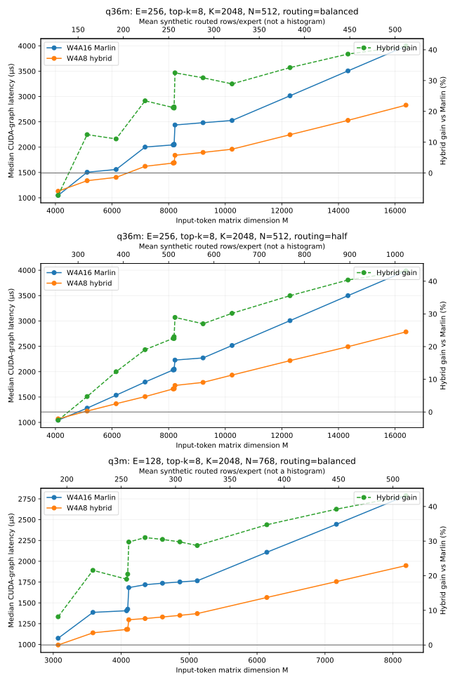

# Hopper Marlin NVFP4-to-FP8 experiment ledger

<!-- markdownlint-disable MD060 -->

Date: 2026-08-15
Scope: NVIDIA H100, CUDA implementations only unless a section is explicitly
marked historical and non-CUDA
Primary shape: BF16 output, `M=512`, `N=4096`, `K=4096`

This document records the complete NVFP4-to-FP8 investigation. Performance
success means beating both Marlin W4A16 and staged CUDA; correctness or lower
scratch use alone does not count as a win.

## Definitions and acceptance gates

- **CUDA baseline W4A16** is the existing Marlin path operating on the
  checkpoint's packed NVFP4 weights with BF16 activations.
- **CUDA staged** first materializes the complete weight as E4M3 FP8 plus one
  FP32 scale per `128 x 128` block, then invokes the stock vLLM CUDA CUTLASS
  FP8 GEMM.  The CUTLASS GEMM and its `128 x 128` scale contract are not
  redesigned.
- **CUDA production** is the production converter followed by that same stock
  CUTLASS FP8 GEMM.
- **CUDA direct / SS producer** converts B inside the GEMM's software/shared-
  storage producer path rather than materializing the full FP8 tensor first.
  It is retained as an alternative experiment, not the performance baseline.
- Converter microbenchmarks use `N=K=4096`.  They are independent of `M`;
  `M` matters when converter time is combined with GEMM time.
- The hard converter goal is at most **7.5 us warm on H100**.  Correctness is
  mandatory but does not by itself make a candidate successful.
- A staged end-to-end win means lower CUDA latency than W4A16 at the same
  `(M,N,K)`.  Model evaluation must also be reported for a production change.

Dense-kernel sections use CUDA timings. Later MoE sections explicitly identify
the production Triton routes they measure; all performance numbers name their
backend and measurement protocol.

## Benchmark protocols

### H100 component and GEMM measurements

The retained H100 logs report CUDA-event timings in microseconds.  GPU clock
control was unavailable (`GpuFreq=control_disabled`), so cross-job differences
include clock and node variance.  Comparisons printed on one row or in one job
are the primary comparisons; arithmetic combining separate jobs is labeled an
estimate.

Primary dense shape:

```text
M=512, N=4096, K=4096, BF16 output
```

The raw retained artifacts are under
`/tmp/w4a8-cuda-converter-only-logs/`.  The exact submission wrapper is not
retained in the repository, so this ledger records the artifact name rather
than inventing a command.

### Local Ada converter loop

Local iterations run on an RTX 4090 (`sm_89`) to avoid a full vLLM rebuild and
shorten compile/measure turnaround.  These absolute times are not substituted
for the H100 gate; they rank generic CUDA changes before an H100 confirmation.

Compile:

```bash
nvcc -O3 -std=c++17 -arch=sm_89 -lineinfo --expt-relaxed-constexpr \
  -I csrc/libtorch_stable/quantization/marlin -I csrc \
  -I .venv/lib/python3.12/site-packages/torch/include \
  -I .venv/lib/python3.12/site-packages/torch/include/torch/csrc/api/include \
  benchmarks/kernels/marlin_nvfp4_w4a8_sm90/converter_lab.cu \
  -o /tmp/e2m1_probe
```

Run:

```bash
/tmp/e2m1_probe
```

Each reported local timing uses 100 warm-up launches and 500 CUDA-event timed
launches.  The input is the full `4096 x 4096` packed tensor generated by
`std::mt19937(11)`.  The current oracle uses processed scale bytes `0x38`,
divisor bytes `0x38`, and global scale `1.0`.

The correctness gate compares all 16,777,216 FP8 output bytes and all 1,024
FP32 output scales exactly against the copied production reference kernel.  A
result is only attributed to the candidate selected immediately before the
copy-back.  The uniform scale/divisor oracle exercises every random FP4 nibble
but is not an exhaustive scale oracle; any algebraic conversion change still
requires randomized and adversarial scale/divisor codes before promotion.

## Data movement and reference-kernel audit

For `N=K=4096`, one complete conversion has the following compulsory logical
traffic:

| Object | Size |
|---|---:|
| Packed E2M1 input (`2,097,152` `int32` words) | 8 MiB |
| Processed per-group scales | 1 MiB |
| E4M3 output | 16 MiB |
| Divisor codes | 1 KiB |
| FP32 output scales | 4 KiB |
| Global scale | 4 B |
| **Minimum total** | **about 25.005 MiB** |

At 3.35 TB/s, 25 MiB alone corresponds to about 7.83 us if every byte comes
from HBM.  The 7.5 us target is therefore a warm-cache target: it requires
substantial input reuse from L2 plus nearly ideal issue and store behavior.

The production reference launches 8,192 CTAs of 256 threads.  Each CTA owns a
fixed `N64 x K32` tile, reads 256 packed words (1 KiB), reads 128 scale bytes,
and writes 2 KiB of FP8.  It stages a 2 KiB converted tile and 256 B of scales
in shared memory, computes one reciprocal, and executes three CTA barriers.
That is 24,576 barrier instances per full conversion.  The converted-tile
writes are eight-way shared-memory-bank conflicted.  Its flattened one-
dimensional tile mapping also leaves runtime integer divide/modulo helpers in
SASS.  There were no spills.

Resource audit:

| Kernel | Registers/thread | Static shared memory |
|---|---:|---:|
| Production converter object | 24 | 3,332 B |
| Standalone copied reference | 31 | 2,308 B |
| Shared packed-tile candidate | 24 | 8,196 B |
| Output-owned 128 | 33 | 0 B |
| Output-owned 256 | 30 | 0 B |
| Output-owned 512 | 23 | 0 B |
| Output-owned 1024 | 21 | 0 B |
| Paired-output 64/128 | 40 | 0 B |
| Paired-output 256 | 35 | 0 B |

The fixed Marlin lane/layout transform is address arithmetic, not a general
runtime permutation.  The costly property of the reference is the particular
CTA/shared-memory organization around that transform.

## H100 chronology

### Direct SS producer revisions

Every row below passed `direct_vs_staged` exact output equality
(`finite=True`, `max_abs=0`, `rel_l1=0`) where the log recorded the component
breakdown.  The direct path nevertheless lost badly.  Some intermediate
source revisions are no longer uniquely identifiable from the raw artifact;
those rows are retained as timing evidence without assigning an invented
change description.

| Raw artifact | W4A16 | Direct | Converter | CUTLASS FP8 | Staged | Direct / W4A16 | Direct / staged |
|---|---:|---:|---:|---:|---:|---:|---:|
| `threeway-6597396.log` | 67.376 | 296.720 | n/r | n/r | 50.784 | 4.403x | 5.843x |
| `threeway-6597434.log` | 65.440 | 287.968 | 28.608 | 21.888 | 47.152 | 4.400x | 6.107x |
| `threeway-6597518.log` | 66.912 | 617.008 | 29.056 | 21.984 | 47.936 | 9.221x | 12.872x |
| `threeway-6598026.log` | 65.152 | 199.008 | 28.704 | 21.792 | 47.008 | 3.055x | 4.234x |
| `threeway-6598368.log` | 65.664 | 351.632 | 28.832 | 22.144 | 47.488 | 5.355x | 7.405x |
| `threeway-6598410.log` | 65.472 | 183.088 | 28.864 | 22.144 | 47.232 | 2.797x | 3.876x |
| `overlap-6598604.log` | 66.496 | 183.520 | 29.808 | 22.720 | 49.456 | 2.760x | 3.711x |
| `production-6598691.log` | 65.200 | 183.120 | 28.784 | 21.888 | 46.432 | 2.809x | 3.944x |
| `threeway-6599825.log` | 65.248 | 287.760 | 28.736 | 21.824 | 47.344 | 4.410x | 6.078x |
| `threeway-6600165.log` | 66.368 | 512.736 | 28.832 | 21.904 | 47.424 | 7.725x | 10.812x |

`overlap-6598604.log` also measured converter and CUTLASS on separate streams:
50.080 us versus 49.456 us staged.  There was no useful overlap; contention
made it 0.624 us slower.

Why direct did not work: the B-converting producer is a throughput problem,
not a one-time launch-latency problem.  At `M=512`, the GEMM decomposes M into
multiple CTA tiles.  Each tile logically consumes B again, so conversion work
is repeated with the B-consumer schedule.  The tensor-core GEMM already has
work resident across the available SMs; producer warps do not get idle SMs.
They share warp schedulers, registers, L1/shared-memory bandwidth, and CTA
residency with the MMA consumer.  The observed 183--617 us direct times are far
beyond a simple two-times byte-width penalty, proving that repeated conversion
and producer/consumer serialization dominate.  Materializing B once allows a
device-wide converter launch and lets every subsequent GEMM tile read the
same FP8 tensor, commonly from cache.

The phrase "B is read four times" is a logical GEMM-tile statement, not four
guaranteed HBM fills.  The compressed 8 MiB B input fits comfortably in H100
L2, so repeated logical reads can hit L2.  Direct conversion still repeats the
instructions and CTA-local movement; the earlier SS design also generated
about 64 MiB of CTA-local shared-memory output stores across four M tiles.

### Production staged component result

`final-6598937.log`, `M=512, N=K=4096`:

| Component/path | Time (us) |
|---|---:|
| W4A16 baseline | 63.072 |
| Converter only | 28.928 |
| Stock CUDA CUTLASS FP8 GEMM only | 21.504 |
| Staged harness | 47.104 |
| Production converter + CUTLASS | 47.056 |

Production and staged outputs were exactly equal (`max_abs=0`).  Production
was 1.340x faster than W4A16 and had 0.999x the staged overhead.  Component
times do not add exactly because each is independently event-timed and the
combined path has cache/launch interactions.

The GEMM performs `2*M*N*K = 17.180` GFLOP.  At 21.504 us that is about
799 TFLOP/s.  Tensor cores and M-dimension reuse make this dense GEMM shorter
than the scalar/layout converter; that is possible, but 28.928 us remains an
underperforming converter rather than a floor.

The complete production knee job below measured 55.776 us at `M=512` versus
47.104 us for the prequantized-activation staged component job.  Their
difference, **8.672 us**, is the cross-job estimate for activation
quantization plus wrapper/context overhead.  It is not an exact same-run
decomposition because the values came from different jobs/nodes.

### M crossover

The initial knee sweep (`knee-6598761.log`) found the first sampled win at
`M=384`:

| M | W4A16 (us) | Production staged (us) | W4A16 / production |
|---:|---:|---:|---:|
| 32 | 16.320 | 48.992 | 0.3331x |
| 64 | 20.704 | 44.720 | 0.4630x |
| 128 | 26.208 | 44.768 | 0.5854x |
| 256 | 37.152 | 45.408 | 0.8182x |
| 384 | 51.552 | 46.464 | 1.1095x |
| 512 | 63.552 | 47.984 | 1.3244x |
| 640 | 79.024 | 60.128 | 1.3143x |
| 768 | 93.248 | 60.240 | 1.5479x |
| 1024 | 115.952 | 61.408 | 1.8882x |

The complete-production confirmation (`production-knee-6604164.log`) included
activation quantization/wrapper context and sampled more densely:

| M | W4A16 (us) | Complete staged (us) | staged / W4A16 | Correctness vs BF16 baseline |
|---:|---:|---:|---:|---|
| 64 | 20.576 | 49.328 | 2.397356 | finite, max 72, rel-L1 0.0256972574 |
| 128 | 27.008 | 48.832 | 1.808057 | finite, max 72, rel-L1 0.0257641245 |
| 192 | 35.648 | 52.176 | 1.463645 | finite, max 72, rel-L1 0.0257444046 |
| 256 | 38.560 | 50.304 | 1.304564 | finite, max 75, rel-L1 0.0257537328 |
| 320 | 47.296 | 53.536 | 1.131935 | finite, max 80, rel-L1 0.0257453602 |
| **384** | **53.168** | **52.992** | **0.996690** | finite, max 80, rel-L1 0.0257337131 |
| 448 | 59.776 | 57.584 | 0.963330 | finite, max 80, rel-L1 0.025749011 |
| 512 | 64.272 | 55.776 | 0.867812 | finite, max 80, rel-L1 0.0257459022 |
| 640 | 80.336 | 69.520 | 0.865365 | finite, max 84, rel-L1 0.0257513151 |
| 768 | 96.576 | 71.872 | 0.744202 | finite, max 84, rel-L1 0.0257510412 |
| 1024 | 119.840 | 75.200 | 0.627503 | finite, max 84, rel-L1 0.0257391166 |

Thus `M=384` is the smallest measured win, but only by 0.176 us and within
normal run variance.  `M=448` is the first clear measured win; `M=512` wins by
8.496 us (1.152x).

The shape sweep (`shapes-6598807.log`) confirmed the same trend:

| N | K | M | W4A16 (us) | Production (us) | Speedup |
|---:|---:|---:|---:|---:|---:|
| 4096 | 4096 | 384 | 52.096 | 46.848 | 1.1120x |
| 4096 | 4096 | 512 | 63.744 | 47.872 | 1.3316x |
| 6144 | 4096 | 384 | 73.136 | 72.160 | 1.0135x |
| 6144 | 4096 | 512 | 92.976 | 72.768 | 1.2777x |
| 11008 | 4096 | 384 | 118.592 | 102.464 | 1.1574x |
| 11008 | 4096 | 512 | 152.608 | 114.592 | 1.3318x |
| 4096 | 11008 | 384 | 114.752 | 107.568 | 1.0668x |
| 4096 | 11008 | 512 | 147.904 | 110.992 | 1.3326x |
| 14336 | 4096 | 384 | 149.440 | 135.168 | 1.1056x |
| 14336 | 4096 | 512 | 196.432 | 148.224 | 1.3252x |
| 4096 | 14336 | 384 | 143.168 | 135.328 | 1.0579x |
| 4096 | 14336 | 512 | 188.176 | 140.704 | 1.3374x |

### Model evaluation

The completed CUDA model-eval job (`model-eval-6599056.log`) reported:

| Mode | Correct / total | Accuracy | Generation | Output tokens | TPS | QPS |
|---|---:|---:|---:|---:|---:|---:|
| W4A16 baseline | 934 / 1319 | 70.8112% | 20.648 s | 114,663 | 5,553.24 | 63.8804 |
| Production, knee 384 | 914 / 1319 | 69.2949% | 63.470 s | 112,747 | 1,776.39 | 20.7816 |

The production model evaluation did not meet the throughput or accuracy
acceptance goal even though the isolated production converter output was
bit-exact to the staged converter reference.  Knee experiments at 512 and
1024 separately reported the same `914/1319` accuracy, with generation
63.647/63.560 s and 1,771.45/1,773.87 TPS respectively; the sweep was then
cancelled before further knee values completed.

## Local Ada converter chronology

All valid speedups in this section are relative to the copied production
reference in the same invocation.

### 1. Input-coalesced shuffle prototype

Goal: have each warp load 32 adjacent packed words, then use warp shuffles to
gather the four pair fragments for adjacent output bytes without a CTA-wide
barrier.

Result: 34.904 us versus 13.961 us reference, with 11,796,680 mismatched bytes.
Rejected for correctness and performance.  The first implementation's lane
gather/packing mapping was wrong; coalescing alone did not compensate for the
shuffle and duplicated-conversion schedule.

### 2. Output-owned, zero-barrier kernel

Each thread owns one contiguous 16-byte FP8 output segment, gathers its four
packed words directly, converts them in registers, and writes one `uint4`.
This deletes all shared-memory staging and CTA barriers.

First exact run: 12.456 us versus 13.953 us reference, a 1.1202x speedup.

Thread-count sweep:

| Variant | Time (us) | Same-run reference | Speedup |
|---|---:|---:|---:|
| Output-owned 128 | 10.762 | 13.920 | 1.2934x |
| Output-owned 256 | 12.407 | 13.920 | 1.1220x |
| Output-owned 512 | 12.065 | 13.920 | 1.1537x |
| Output-owned 1024 | 15.028 | 13.920 | 0.9263x |

The 128-thread version won this family.  Larger blocks did not reduce the
uncoalesced packed-load cost and increased scheduling/register pressure.

### 3. Shared packed-tile staging

Goal: load an 8 KiB packed tile coalesced into shared memory, synchronize once,
then let output-owned threads consume it locally.

Result: 12.163 us versus 13.933 us reference and 10.770 us for output-owned
128 in the same run.  Rejected: one CTA barrier plus shared-memory traffic was
1.393 us slower than duplicate reads hitting the warm cache.

### 4. Paired-row ownership

One thread produces both Marlin rows (`n0` and `n1`) sourced from each packed
word.  This shares the four packed loads and conversion setup while keeping
contiguous 16-byte stores.  The first lane ordering destroyed store coalescing
and took 30.8--31.2 us.  Reordering a warp to four row-pairs by eight K16
segments restored contiguous 128-byte row stores.

Corrected sweep:

| Variant | Time (us) | Same-run reference |
|---|---:|---:|
| Output-owned 128 control | 10.787 | 13.926 |
| Paired 64 | 10.922 | 13.926 |
| Paired 128 | 10.668 | 13.926 |
| Paired 256 | 10.492 | 13.926 |
| Paired 512 | 10.385 | 13.955 |

Paired 512 became the best valid variant.  A repeat measured 10.365 us versus
13.941 us reference, 1.3450x.

### 5. Algebraic and instruction variants

- Moving the fixed FP4 bias into the scale (`dequant<..., true>` and scale
  multiplied by 16,384) was exact only under the current uniform-scale oracle.
  It measured 10.387 us versus 10.365 us unfused, so it was rejected without
  weakening the generic conversion contract.
- A direct bitwise E2M1-to-half decoder measured 14.438 us in the latest run,
  39.4% slower than paired 512.  Rejected.
- Adding `ld.global.L2::128B` cache hints measured 10.394 us versus 10.361 us
  paired 512.  It was the candidate selected for the latest exact gate:
  `mismatches=0`, `scale_mismatches=0`.  No gain; rejected.
- A vector-output ownership variant measured 10.549 us.  It did not beat
  paired 512.  It was timed in the aggregate run but was not the candidate
  selected for that invocation's copy-back equality check.
- The slavish fused E4M3 byte-pack sequence uses two immediately adjacent
  `cvt.rn.satfinite.e4m3x2.f16x2` instructions followed immediately by
  `mov.b32 {low_bytes, high_bytes}` in one inline-PTX block, mirroring the
  ptxas-recognized CUTLASS idiom.  It measured 10.397 us versus 10.361 us base
  paired 512.  It did not improve Ada performance.  This candidate was not the
  one selected for the latest copy-back equality check, so an isolated exact
  check remains required before any H100 SASS/timing test.
- Reduced-Y "persistent" launch timings of 2.789 us (`512 x 128`), 3.760 us
  (`512 x 256`), and 6.193 us (`256 x 512`) are **invalid**: the kernel had no
  grid-stride K-block loop, so those launches converted only part of the
  tensor.  They are not speedups or target hits.

Latest aggregate Ada run:

```text
correct=true mismatches=0 first=16777216 scale_mismatches=0
reference_us=13.941
output128_us=10.781 output256_us=12.431
output512_us=12.069 output1024_us=15.041
shared_tile_us=12.157 warp_us=31.283 vector_us=10.549
paired64_us=10.953 paired128_us=10.676
paired256_us=10.443 paired512_us=10.361
persistent512x128_us=2.789 persistent512x256_us=3.760
persistent256x512_us=6.193
paired_fused512_us=10.438 paired_packed512_us=10.397
paired_direct_decode512_us=14.438 paired_prefetch512_us=10.394
best_speedup=1.3455x
```

The exact line belongs to the prefetch candidate selected before copy-back;
the aggregate harness does not re-run copy-back comparison after every timed
variant.

### 6. NCU diagnosis of paired 512

Command:

```bash
ncu --target-processes all --kernel-name paired_output_kernel \
  --launch-count 1 --set full /tmp/e2m1_probe
```

The profiled specialization was paired-output 512 with fused bias.  Memory
behavior is representative of the unfused paired mapping.

| Counter | Value |
|---|---:|
| Profiled duration | 15.17 us |
| Grid / block | 1,024 CTAs / 512 threads |
| SMs / waves per SM | 128 / 2.67 |
| DRAM throughput | 63.55% |
| Reported memory throughput | 622.91 GB/s |
| L1 / L2 throughput | 45.46% / 61.89% |
| L1 / L2 hit rate | 71.70% / 64.20% |
| Compute throughput | 22.01% |
| Active / eligible warps per scheduler | 9.56 / 0.62 |
| L1TEX scoreboard stall | 24.2 cycles average |
| Stall share per issued instruction interval | 65% of 37.2 cycles |
| Useful bytes per load sector | 4 / 32 B |
| Excessive load sectors | 2,064,384 / 2,902,016 (71%) |
| Store utilization | 31.5 / 32 B |
| Achieved / theoretical occupancy | 79.4% / 100% |
| Registers | 29 per thread |

NCU estimated a 33.68% speedup opportunity from uncoalesced loads and 62.25%
at the annotated source sites.  Stores were already nearly ideal; their
estimated opportunity was only 0.94%.  The partial final wave was estimated
at 33.3%.  The measured limiter is therefore packed-load coalescing and the
resulting L1TEX dependency stalls, not FP4 arithmetic, reciprocal cost, store
bandwidth, occupancy, or missing CTA-wide barriers.

### 7. Coalesced shared tile: layout iterations

The next family retained output ownership but paid one CTA barrier to replace
the paired kernel's scattered global reads with coalesced `uint4` loads into an
8 KiB shared packed tile.  The initial shared layout had severe bank conflicts.
Padding changed the measured time from 12.218 us to 10.473 us.  A first
conflict-free swizzle reached 10.258 us.

Changing the launch from a flattened 1-D grid to native `dim3(32, 32)` removed
the generated block-index quotient/remainder work.  The flattened prologue was
about 74 instructions; the 2-D version was about 12.  The resulting exact
candidate measured 10.209 us.

The final pair-contiguous packed-tile index was:

```text
bank = 4 * ((column ^ k_group) & 7) + pair
high = (4 * n_subtile + marlin_warp) * 8 + k_group
index = 32 * high + bank
```

This makes the producer's scalar stores bank-conflict-free and lets a consumer
read all four pair words with one aligned `LDS.128`.  It measured 10.025 us.
This is a fixed shared-memory address swizzle only; it does not change the
Marlin global layout or perform a general permutation.

Rejected layouts in this family:

- Warp-private `cp.async` staging was exact but measured 13.84 us.
- Staging scales in shared memory and broadcasting them with warp shuffles was
  exact but measured 11.043 us.
- A 256-thread single-row tiled kernel was exact at 10.62 us.
- Reduced persistent grids measured 10.52--10.61 us when made complete.  The
  non-persistent reduced-grid attempts were incomplete and therefore invalid;
  those launch paths were removed.
- A CTA owning a 2x2 set of 128x128 tiles measured about 11.01 us.  The saved
  launch wave did not repay the larger shared footprint and scheduling cost.

### 8. Scale staging and instruction-order trials

Raw 1 KiB scale staging initially measured 10.174 us.  Vectorizing the scale
copy and using the packed-tile swizzle brought the complete path to about
9.99 us.  Issuing 256 four-byte `cp.async.ca.shared.global` scale copies before
packed staging, then using the same single CTA barrier, measured 9.976 us.  The
copy is overlapped; it does not add a second barrier.

The following scale/load variants lost and were reverted:

- Per-thread register prefetch of the processed scale measured 10.18--10.26 us.
- Reordering output-side loads measured 10.03 us versus the 9.976 us control.
- A byte-scattered conflict-free scale layout measured 10.254 us.
- A word-level bank-shift scale layout measured 10.312 us.
- Replacing the normal conversion with an explicit
  `cvt.rn.satfinite.f16.f32` shortcut produced no measurable gain.

These results do not mean scale traffic is intrinsically expensive: the scale
tile is only 1 KiB.  They show that the extra address arithmetic, shuffles, or
instructions in these mappings cost at least as much as the conflicts removed.

### 9. Register reciprocal and paired tiled consumer

The reference stores one tile reciprocal in shared memory.  The winning tiled
path instead has lane zero of each warp load the divisor, compute `__frcp_rn`,
and broadcast the reciprocal with `__shfl_sync`; only thread zero writes the
output scale.  This removes the shared reciprocal load without changing the
conversion.  The single-row tiled result improved from 9.976 us to 9.900 us.

The paired consumer makes each thread generate both Marlin rows (`n0`, `n1`)
from the same `LDS.128` packed-word vector.  It therefore shares the packed
load and unpack work while retaining two contiguous 16-byte stores.  Before
the register reciprocal it measured about 10.19 us.  With the reciprocal in a
register, clean sequential paired-512 runs measured 9.822, 9.857, and 9.838 us;
the corresponding single-row tiled runs were 9.884--9.917 us.

Paired 256 uses two output passes per thread and the same 1,024-CTA 2-D grid.
A current isolated run measured:

```text
correct=true mismatches=0 first=16777216 scale_mismatches=0
reference_us=13.961 shared256_us=9.940 shared512_us=9.900
paired_tile_us=9.970 paired_tile256_us=9.818
super256x256_us=11.034 warp_staged_us=13.920
```

The exact gate above used random packed words plus varied processed scale and
divisor codes, not the earlier uniform `0x38` input.  The generator seed was
11; processed scale bytes were sampled from `0x00..0x7e`, and divisor bytes
from nonzero `0x01..0x7e`.  It compared all 16,777,216 FP8 output bytes and all
1,024 output-scale values against the copied reference.  Both mismatch counts
were zero.  Timings are one local Ada invocation and should not be mixed with
H100 acceptance numbers.

The two processed scales for a paired row always occupy one aligned shared
word.  Replacing two byte loads with one `LDS.U32` and extracting both bytes
halved reported shared conflicts from 229,376 to 114,688.  Timing was neutral:
one clean run measured 9.849 us versus the preceding 9.838 us paired result.
It remains useful as a simpler single-load consumer, but is not counted as a
measured speedup.

### 10. NCU diagnosis of the tiled paired result

The latest full NCU pass profiled the paired tiled specialization.  Profiling
overhead raised duration to 14.88 us; normal event timing was about 9.85 us.

| Counter | Value |
|---|---:|
| Profiled duration | 14.88 us |
| Grid / block | 1,024 CTAs / 512 threads |
| SMs / waves per SM | 128 / 2.67 |
| Registers | 35 per thread |
| Static shared memory | 9.22 KiB per CTA |
| Register/shared spills | 0 |
| Theoretical resident blocks | 3 per SM |
| Achieved / theoretical occupancy | 86% / 100% |
| DRAM throughput | 64.77% |
| Reported memory throughput | 635 GB/s |
| Compute throughput | 28.31% |
| Average global-load bytes used | 30.1 / 32 B |
| Shared load requests | 32,768 |
| Average shared-load conflict degree | 6-way |
| Excess shared wavefronts/conflicts | 114,688 |
| L1TEX scoreboard stall | 15.2 cycles average |
| Scoreboard share | 47.4% of 32 cycles per issued instruction |
| Estimated shared-memory speedup opportunity | 16.25% |
| Estimated partial-wave opportunity | 33% |

The packed global-load problem from paired-output 512 is substantially fixed:
30.1 of each 32 requested bytes are now useful.  The remaining measured limits
are shared-load serialization and a 2.67-wave launch with a partial last wave.
The one-word paired scale load halved conflicts but did not lower normal timing,
so its remaining NCU opportunity is an estimate, not an observed speedup.

### 11. Four-word `cp.async` packed scatter

The paired tiled loader originally issued one synchronous 16-byte global load,
then extracted its four words and issued four ordinary shared stores.  The
experiment replaced that sequence with four 4-byte `cp.async.ca` operations
from the adjacent source words directly to their existing pair-contiguous
swizzled shared destinations.  Scale staging remained asynchronous.  Both
streams shared one commit, one wait, and the existing single CTA barrier.

The hypothesis was that removing the register round trip and ordinary shared
stores would outweigh splitting one 16-byte load into four instructions.  The
same seeded varied-scale gate described above passed on every run:

```text
correct=true mismatches=0 first=16777216 scale_mismatches=0
```

Sequential local-Ada A/B timings, in microseconds, were:

| Run | Synchronous load/scatter | 4-byte `cp.async` scatter |
|---:|---:|---:|
| 1 | 9.757 | 9.678 |
| 2 | 9.746 | 9.675 |
| 3 | 9.770 | 9.704 |
| 4 | 9.772 | 9.674 |
| Median | 9.7645 | 9.6765 |

The asynchronous scatter was 0.90% faster at the median.  It is retained as a
lab candidate; production was not changed by this probe.

### 12. Coalesced 16-byte staging with scalar shared reads

This experiment moved the Marlin permutation to the consumer side.  Each of
the 256 threads copied two contiguous 16-byte chunks with `cp.async` into a
padded `uint4 raw_tile[2][8][33]`.  The output-owned paired consumer then read
its four words directly from `raw_tile[n_subtile][k_group][4 * column + pair]`,
selecting the component indexed by the Marlin warp.  It used no warp shuffle
or explicit shared-memory transpose.  Scale staging shared the existing
commit, wait, and single CTA barrier.  The reciprocal used the same
`__fdividef` sequence as the retained asynchronous-scatter control.

The varied-scale exact gate passed in both measured runs:

```text
correct=true mismatches=0 first=16777216 scale_mismatches=0
```

Adjacent local-Ada timings, in microseconds, were:

| Run | 4-byte `cp.async` scatter | Raw 16-byte stage + scalar reads |
|---:|---:|---:|
| 1 | 9.665 | 10.778 |
| 2 | 9.683 | 10.793 |
| Median | 9.674 | 10.7855 |

The raw-staged version was 11.49% slower.  Coalescing the producer did not
repay making each consumer fetch four separated shared words; the retained
scatter instead pays the address permutation while copies are in flight and
presents each consumer with one contiguous four-word shared load.  The raw
scalar variant was reverted, and production was not changed by this probe.

### 13. Fully coalesced word ownership with the retained swizzle

This probe kept the retained pair-contiguous shared layout but reassigned the
2,048 packed words in each 128x128 CTA by
`word = threadIdx.x + 256 * pass`.  Each warp therefore read 32 consecutive
`uint32_t` words per instruction.  The word decomposed into a 128-word Marlin
segment, chunk, and Marlin warp before a 4-byte `cp.async` wrote the existing
`packed_tile_index` destination.  This improved source-sector utilization but
made each coalesced producer instruction target four shared-memory banks.

The seeded varied-scale gate compared all 16,777,216 output bytes and all
1,024 output scales exactly:

```text
correct=true mismatches=0 first=16777216 scale_mismatches=0
```

The isolated adjacent local-Ada result was 9.683 us for the retained
asynchronous scatter and 10.390 us for coalesced word ownership.  The candidate
was 7.30% slower and was reverted.

### 14. Conflict-free coalesced producer/consumer swizzle

The next probe changed both sides of the shared layout.  The fully coalesced
producer retained contiguous 32-word warp reads.  For each decoded
`(n_subtile, k_group, column, pair, marlin_warp)`, it used:

```text
high = (4 * n_subtile + (column >> 1)) * 8 + k_group
bank = 4 * (((4 * (column & 1) + marlin_warp) ^ k_group) & 7) + pair
index = 32 * high + bank
```

Thus each producer instruction wrote all 32 banks once, while a consumer's
four pairs remained an aligned contiguous `uint4` load.  The `k_group` XOR
also distributed the eight lanes' consumer loads across the bank groups.

The same exhaustive output gate passed:

```text
correct=true mismatches=0 first=16777216 scale_mismatches=0
```

The isolated adjacent local-Ada result was 9.668 us for the retained
asynchronous scatter and 9.899 us for the conflict-free coalesced layout.  The
candidate was 2.39% slower and was reverted.  Removing producer and consumer
bank conflicts recovered most of the first coalesced experiment's loss, but
the extra address mapping still did not beat the retained direct scatter.

### 15. Half-coalesced ownership with the retained swizzle

This probe tested the midpoint between the retained strided producer and the
rejected fully coalesced producer without changing the shared layout.  Each
warp still owned one 128-word Marlin segment.  Four 4-byte `cp.async`
instructions covered `mw_half` 0/1 and `chunk_half` 0/1, with each lane using:

```text
chunk = 16 * chunk_half + (lane >> 1)
marlin_warp = 2 * mw_half + (lane & 1)
```

Each instruction therefore used half of each source sector and made two-way
shared-bank writes.  The seeded varied-scale gate remained exact across all
16,777,216 output bytes and 1,024 output scales:

```text
correct=true mismatches=0 first=16777216 scale_mismatches=0
```

The isolated adjacent local-Ada result was 9.678 us for the retained
asynchronous scatter and 9.800 us for the half-coalesced producer.  The
candidate was 1.26% slower and was reverted.

### 16. Conflict-free scale-tile word swizzle

This probe left the retained packed-weight producer and consumer unchanged.
It only stored and loaded each scale word at:

```text
physical_word = logical_word ^ (8 * (k_group >> 1) + (k_group & 1))
```

For the producer, `logical_word` spans 0--31 within a fixed `k_group`, so the
XOR remains a permutation of all 32 shared banks.  For a consumer warp,
`logical_word` contributes the two row-pair bits, `k_group & 1` contributes
bank bit 0, and `k_group >> 1` contributes bank bits 3--4.  The 32 lanes
therefore load all 32 banks once instead of issuing eight distinct addresses
to each of four banks.  No packed-tile address arithmetic changed.

The seeded varied-scale gate compared all 16,777,216 output bytes and all
1,024 output scales exactly in every run:

```text
correct=true mismatches=0 first=16777216 scale_mismatches=0
```

Five adjacent local-Ada A/B timings, in microseconds, were:

| Run | Retained asynchronous scatter | Scale-word swizzle |
|---:|---:|---:|
| 1 | 9.695 | 9.692 |
| 2 | 9.691 | 9.693 |
| 3 | 9.684 | 9.672 |
| 4 | 9.662 | 9.668 |
| 5 | 9.673 | 9.672 |
| Median | 9.684 | 9.672 |

The scale swizzle was 0.12% faster by median and remains as a lab variant.
The gain is small enough that it needs an H100 timing before production use.

### 17. Two-tile asynchronous double buffering

This dense-only experiment reduced the launch from 1,024 to 512 CTAs.  Each
256-thread CTA handled `(n_block, k_block)` and
`(n_block, k_block + 16)`.  It allocated separate 8 KiB packed and 1 KiB scale
buffers for both tiles, preloaded tile 0, then issued tile 1's retained 4-byte
asynchronous scatter before converting and storing tile 0.  A wait and CTA
barrier preceded tile 1 conversion; neither buffer was reused.

The seeded varied-scale gate was exact across all outputs:

```text
correct=true mismatches=0 first=16777216 scale_mismatches=0
```

Sequential local-Ada timings, in microseconds, were:

| Run | 1,024-CTA async scatter | 512-CTA double buffer |
|---:|---:|---:|
| 1 | 9.698 | 9.685 |
| 2 | 9.658 | 9.646 |
| 3 | 9.694 | 9.673 |
| Median | 9.694 | 9.673 |

The double-buffered kernel was 0.22% faster at the median and won all three
adjacent comparisons, so it remains in the lab.  On SM89 it uses 40 registers,
18,432 bytes of static shared memory, and no local memory, versus 38 registers
and 9,216 bytes for the retained single-tile asynchronous scatter.

### 18. Production async-scatter port and wrapper timing

The first production fast path used the retained 256-thread asynchronous
scatter.  After the H100 gate below, dense tensors with an even number of
K/128 blocks switched to the measured two-tile double buffer.  Dense odd-K,
multi-expert, unaligned, non-N128, and padded-resident-K paths remain
unchanged.

The temporary stable-ABI extension was rebuilt from the production source and
compared the fast path against the intentionally unaligned fallback for dense
and three-expert tensors in both FP16- and BF16-resident modes.  All FP8 bytes
and FP32 output scales were exactly equal in all four cases.  The production
translation unit also compiled independently for SM89 and SM90a.

Single-operation CUDA events exposed a launch-spacing artifact.  One event
around 500 normal operator calls matched the direct kernel harness:

| Measurement | Local Ada time |
|---|---:|
| Single-operation event median | 11.264 us |
| Single-operation event minimum | 10.240 us |
| 500-call outer-event average median | 9.656 us |
| 500-call outer-event average minimum | 9.650 us |
| 500 CUDA-graph replay average median | 9.455 us |
| 500 CUDA-graph replay average minimum | 9.439 us |
| Original fallback, single-operation median | 18.432 us |

The 1.608 us difference between the single-event median and batched operator
throughput is host submission/event spacing, not converter execution.  The
latest direct harness invocation measured 13.957 us for its copied original
kernel and 9.683 us for asynchronous scatter, a 1.441x speedup.  These local
SM89 results were used only to rank candidates before the H100 gate.

### 19. CudaGym H100 gate and double-buffer promotion

The existing CudaGym frontend was reconnected to a fresh H100 backend under
Slurm job 6117464 on node pool1-00442.  The probe reported NVIDIA H100 80GB
HBM3, compute capability 9.0, 132 SMs, and 52,428,800 bytes of L2.

The exact retained lab source was compiled with CUDA 13.1, -O3, C++17,
sm_90a, line information, and relaxed constexpr.  Each variant used 100
warm-up launches and 500 CUDA-event samples at N=K=4096.  GPU clock locking
was unavailable.

The first run compiled in 5.533 seconds and was exact across all 16,777,216
output bytes and 1,024 FP32 output scales.  Its complete raw timing line was:

    reference_us=16.575 output128_us=13.174 output256_us=13.070 output512_us=13.658 output1024_us=14.724 shared256_us=7.505 shared512_us=8.296 scale_prefetch_us=8.295 paired_tile_us=8.335 paired_tile256_us=7.426 async_scatter_us=7.614 double_buffer_us=7.326 scale_swizzle_us=7.545 super256x256_us=8.992 warp_us=20.276 async_transpose_us=8.299 vector_us=7.617 paired64_us=9.674 paired128_us=9.104 paired256_us=8.936 paired512_us=9.321 paired_fused512_us=9.249 paired_packed512_us=9.273 paired_direct_decode512_us=16.258 paired_prefetch512_us=9.324 best_speedup=2.2085x

Three fresh executions compiled in 5.566, 5.486, and 5.518 seconds.  Every
execution again had zero byte and scale mismatches.  The complete raw timing
lines were:

    run1 reference_us=16.263 output128_us=13.124 output256_us=13.004 output512_us=13.558 output1024_us=14.658 shared256_us=7.414 shared512_us=8.242 scale_prefetch_us=8.219 paired_tile_us=8.298 paired_tile256_us=7.301 async_scatter_us=7.424 double_buffer_us=7.321 scale_swizzle_us=7.367 super256x256_us=9.060 warp_us=20.197 async_transpose_us=8.229 vector_us=7.544 paired64_us=9.536 paired128_us=9.012 paired256_us=8.889 paired512_us=9.208 paired_fused512_us=9.148 paired_packed512_us=9.174 paired_direct_decode512_us=16.157 paired_prefetch512_us=9.191 best_speedup=2.1935x
    run2 reference_us=16.346 output128_us=13.125 output256_us=13.046 output512_us=13.574 output1024_us=14.613 shared256_us=7.426 shared512_us=8.205 scale_prefetch_us=8.203 paired_tile_us=8.258 paired_tile256_us=7.352 async_scatter_us=7.457 double_buffer_us=7.326 scale_swizzle_us=7.406 super256x256_us=9.068 warp_us=20.183 async_transpose_us=7.931 vector_us=7.373 paired64_us=9.506 paired128_us=9.013 paired256_us=8.910 paired512_us=9.162 paired_fused512_us=9.129 paired_packed512_us=9.148 paired_direct_decode512_us=16.126 paired_prefetch512_us=9.173 best_speedup=2.2012x
    run3 reference_us=16.490 output128_us=13.408 output256_us=13.232 output512_us=14.049 output1024_us=15.053 shared256_us=7.624 shared512_us=8.679 scale_prefetch_us=8.714 paired_tile_us=8.705 paired_tile256_us=7.558 async_scatter_us=7.753 double_buffer_us=7.489 scale_swizzle_us=7.686 super256x256_us=9.271 warp_us=20.351 async_transpose_us=8.383 vector_us=7.702 paired64_us=9.721 paired128_us=9.192 paired256_us=9.083 paired512_us=9.716 paired_fused512_us=9.683 paired_packed512_us=9.667 paired_direct_decode512_us=16.618 paired_prefetch512_us=9.666 best_speedup=2.1630x

The H100 medians were 16.346 us for the copied original kernel, 7.457 us for
the 1,024-CTA asynchronous scatter, and **7.326 us** for the 512-CTA double
buffer.  The double buffer passed the <=7.5 us target in all three executions
(7.321, 7.326, and 7.489 us), was 2.231x faster than the copied original by
median, and was promoted to the production dense-even-K path.  SM89 and SM90a
translation-unit builds passed, as did exact dense and three-expert FP16/BF16
local gates.  Cached H100 production build job 6621567 rebuilt one CUDA object
and relinked the ABI in 39 seconds.

### 20. H100 scale-bank swizzle

The retained double buffer still loaded each scale word through an eight-way
shared-bank collision.  The producer and consumer therefore stored and loaded
logical word `w` at
`w ^ (8 * (k_group >> 1) + (k_group & 1))`.  This is a permutation within
each K-group row; it changes no byte or arithmetic operation.

The first CudaGym execution compiled in 5.600 seconds, was exact across all
16,777,216 output bytes and 1,024 output scales, and measured 16.350 us for the
copied original and 7.264 us for the double buffer.  Three independent
confirmation executions under
`/tmp/cudagym-converter-h100-db-swizzle-repeat3` were also exact:

| Run | Compile s | Copied original us | Async scatter us | Double buffer us |
|---:|---:|---:|---:|---:|
| 1 | 5.532 | 16.721 | 7.710 | 7.397 |
| 2 | 5.524 | 16.630 | 7.734 | 7.422 |
| 3 | 5.566 | 16.233 | 7.409 | 7.245 |
| Median | - | 16.630 | 7.710 | **7.397** |

All three double-buffer measurements remained below 7.5 us.  Source hash
`1faff54a6699d2cf0cecc82607a809e6f0aff52c697332fa58c132fbb1d5b2a8`
was rebuilt by job 6621754 in 42 seconds: one CUDA object and one ABI relink.

### 21. Rejected shared reciprocal

The double buffer already has a CTA barrier after its first asynchronous
stage.  A minimal experiment let thread 0 compute both reciprocals into shared
memory before that existing barrier, replacing the same calculation in every
warp.  It added no barrier and preserved generic divisor handling.  The
artifact is `/tmp/cudagym-converter-h100-shared-reciprocal`.

| Run | Compile s | Copied original us | Async scatter us | Candidate us |
|---:|---:|---:|---:|---:|
| 1 | 5.544 | 16.634 | 7.582 | 7.539 |
| 2 | 5.544 | 16.228 | 7.452 | 7.236 |
| 3 | 5.560 | 16.289 | 7.629 | 7.440 |
| Median | - | 16.289 | 7.582 | **7.440** |

Every run had zero output-byte and output-scale mismatches.  Its median was
0.043 us slower than the preceding 7.397 us double-buffer median, so the
shared reciprocal was reverted and never entered production.

### 22. Specialized scale addressing

For this fixed 128x128 paired layout, the generic processed-scale permutation
reduces exactly to:

```text
scale_byte = marlin_warp & 1
logical_scale_word = 16*n_subtile + 2*column + (marlin_warp >> 1)
```

The second output row uses byte `scale_byte + 2` of the same word.  Replacing
the generic row permutations with this identity removed one variable shift
and redundant integer address work without changing the scale bytes.  The
artifact is `/tmp/cudagym-converter-h100-specialized-scale`.

| Run | Compile s | Copied original us | Async scatter us | Candidate us |
|---:|---:|---:|---:|---:|
| 1 | 5.544 | 16.631 | 7.466 | 7.377 |
| 2 | 5.511 | 16.243 | 7.420 | 7.340 |
| 3 | 5.520 | 16.335 | 7.560 | 7.292 |
| Median | - | 16.335 | 7.466 | **7.340** |

All 16,777,216 output bytes and 1,024 scales matched exactly in every run.
Source hash
`60e8ebb0ddf56193f4d0a06479112e4a28000a616fa7e9535a3ec8915112a143`
was rebuilt by job 6621908 in 40 seconds.

### 23. Fused E4M3 byte pack and final production gate

The final change follows the ptxas-recognized sequence directly: two adjacent
`cvt.rn.satfinite.e4m3x2.f16x2` instructions followed immediately by
`mov.b32`.  Each instruction converts two scaled FP16 values; `mov.b32`
combines their two 16-bit results without the C++ shift/OR pack.  There is no
lookup table and no change to dequantization, scaling, saturation, or output
order.

The CudaGym artifact `/tmp/cudagym-converter-h100-fused-pack` was exact in all
three executions:

| Run | Compile s | Copied original us | Async scatter us | Final kernel us |
|---:|---:|---:|---:|---:|
| 1 | 5.514 | 16.758 | 7.657 | 7.451 |
| 2 | 5.604 | 16.290 | 7.470 | 7.277 |
| 3 | 5.578 | 16.589 | 7.455 | 7.335 |
| Median | - | 16.589 | 7.470 | **7.335** |

Every final-kernel run was below 7.5 us.  Relative to the original 16.346 us
H100 median in section 19, the final 7.335 us median is 2.228x faster.  Final
source hash
`256c0a35bc3d8a7cb4aa25de5a9a6a562d6d80d208070e9bff36a9e2186e7ce6`
was rebuilt by job 6621991 in 42 seconds, again as one CUDA object plus one ABI
relink.

Every production row below compared the composite output against standalone
conversion plus stock CUDA CUTLASS and reported `exact=True, max_abs=0`.
Times are CUDA-event microseconds at M=512, N=K=4096, BF16.  `Batch` is one
outer event divided across 500 calls; `graph` is divided across 500 graph
replays.  GPU clocks remained unlocked.

| Job | Production revision | W4A16 | Converter | CUTLASS | Staged | Production | Converter batch | Staged batch | Production batch | Converter graph | Production graph |
|---:|---|---:|---:|---:|---:|---:|---:|---:|---:|---:|---:|
| 6621593 | double buffer | 63.904 | 11.488 | 21.664 | 30.080 | 29.984 | - | - | - | - | - |
| 6621636 | double buffer | 63.456 | 11.456 | 22.400 | 30.384 | 30.320 | 7.667 | 27.634 | 28.027 | - | - |
| 6621694 | double buffer | 63.648 | 11.392 | 21.632 | 29.376 | 29.696 | 7.665 | 27.606 | 27.250 | 7.524 | 26.010 |
| 6621775 | scale swizzle | 63.488 | 11.568 | 21.408 | 30.064 | 29.808 | 7.868 | 27.901 | 27.807 | 7.510 | 26.061 |
| 6621797 | scale-swizzle repeat | 63.008 | 11.488 | 21.216 | 29.536 | 29.408 | 7.631 | 27.512 | 27.250 | 7.504 | 26.044 |
| 6621930 | specialized scale address | 64.000 | 11.392 | 21.920 | 30.592 | 30.464 | 7.797 | 28.633 | 28.722 | 7.504 | 26.600 |
| 6621997 | fused byte pack | 63.296 | 10.848 | 22.720 | 30.848 | 30.880 | **7.457** | 28.933 | 29.179 | **7.310** | **27.761** |

The final deployed converter therefore passes the 7.5 us gate both batched
(7.457 us) and under CUDA graph replay (7.310 us).  Its complete production
graph path is 63.296 / 27.761 = **2.280x faster** than the measured W4A16
baseline in the final row.  Within that row, the normal single-call composite
is 30.880 us versus 30.848 us for explicit staged conversion plus CUTLASS, a
0.10% difference.

### 24. Post-gate H100 scheduling and pipeline sweep

After the production gate passed, the retained kernel stayed fixed while each
candidate below was built in a private or transient lab source.  Every
correctness gate compared all 16,777,216 FP8 output bytes and all 1,024 FP32
output scales.  No rejected candidate entered the production source.

#### Adjacent-K tile pairing

The retained double buffer pairs K block (k) with (k+16).  An alternative
paired (2k) with (2k+1) to improve locality.  A first isolated execution
measured 7.327, 7.309, and 7.251 us, but a controlled same-binary A/B did not
confirm that apparent win:

| Run | Split-K retained us | Adjacent-K us |
|---:|---:|---:|
| 1 | 7.292 | 7.287 |
| 2 | 7.397 | 7.402 |
| 3 | 7.229 | 7.269 |
| Median | **7.292** | 7.287 |

Both paths were exact, but adjacent-K lost two of three paired runs.  The
5-ns median difference is below run variation, so the candidate was rejected.
Artifact: `/tmp/cudagym-converter-h100-adjacent-k-ab`.

#### Delayed second-tile metadata

Moving the second tile's divisor, reciprocal, and output-scale preparation
after consumption of tile 0 shortened their live range in static SASS.  It
remained exact but measured 7.557, 7.685, and 7.636 us, median **7.636 us**.
That is 4.10% slower than the 7.335-us retained direct-harness median.
Artifact: `/tmp/cudagym-converter-h100-late-scale`.

#### Grid-axis order

Swapping the N and K grid axes to change CTA launch order remained exact and
measured 7.370, 7.518, and 7.336 us, median **7.370 us**.  It did not improve
the retained 7.335-us median and was reverted.
Artifact: `/tmp/cudagym-converter-h100-grid-order`.

#### Four-tile persistent CTA

This candidate halved the grid again, from 512 to 256 CTAs, and streamed four
K tiles through the same two shared buffers.  The comparison was in one
binary:

| Run | Retained two-tile us | Four-tile us |
|---:|---:|---:|
| 1 | 7.449 | 7.547 |
| 2 | 7.437 | 7.602 |
| 3 | 7.435 | 7.510 |
| Median | **7.437** | 7.547 |

Both paths were exact.  Four tiles were 1.48% slower: 256 CTAs expose only
about two CTAs per 132-SM H100, and the longer dependency chain costs more
than the extra copy/consume overlap hides.  Artifact:
`/tmp/cudagym-converter-h100-fourtile-r2`.

#### 512-thread two-tile CTA

The 512-thread variant kept the 512-CTA grid but gave each thread one staging
and one consumption pass instead of two.  It reduced register use from 38 to
32, with both variants using 18,432 bytes of shared memory, one barrier, and
zero spills.

| Run | 256 threads us | 512 threads us |
|---:|---:|---:|
| 1 | 7.571 | 7.829 |
| 2 | 7.509 | 7.854 |
| 3 | 7.535 | 7.792 |
| Median | **7.535** | 7.829 |

Both paths were exact.  The larger block was 3.90% slower, showing that
resident-warp count is not the remaining limiter.
Artifact: `/tmp/cudagym-converter-h100-double512-ab`.

### 25. Post-gate H100 arithmetic sweep

#### Folding the E2M1 bias into scale

The current exact dequantization creates the E2M1 half values and applies the
fixed (2^{14}) FP4-to-FP16 exponent bias with half2 multiplication.  Folding
that power of two into the later scale would remove those bias multiplies.
It is not generic: `scale * 16384` can overflow before the FP4 magnitude
reduces it.

The exact full-domain version therefore required an overflow fallback:

| Run | Retained us | Folded plus fallback us |
|---:|---:|---:|
| 1 | 7.447 | 7.727 |
| 2 | 7.426 | 7.819 |
| 3 | 7.336 | 7.630 |
| Median | **7.426** | 7.727 |

Under the real preprocessing invariant, a pure folded path was also exact:

| Run | Retained us | Pure folded us |
|---:|---:|---:|
| 1 | 7.301 | 7.350 |
| 2 | 7.434 | 7.504 |
| 3 | 7.418 | 7.444 |
| Median | **7.418** | 7.444 |

The exact fallback lost 4.05%; even the restricted version lost 0.35%.  A
pure fold on unrestricted synthetic ratios was invalid, with 5,455,087 byte
mismatches.  Artifacts: `/tmp/cudagym-fold-bias-exact-ab` and
`/tmp/cudagym-fold-bias-invariant-ab`.

#### Explicit half2 scale hoist

Hoisting `__half2half2(scale)` outside the unrolled conversion loop produced
byte-identical SM90a SASS.  Both versions used 34 registers, 18,432 bytes of
shared memory, zero spills, 784 instructions through `EXIT`, and 95 HMUL2
occurrences.  Their instruction-line SHA-256 was identical:
`9dc57f473fceea9de349f270e21de4c4664fe8718e53fecc6177bcb31e50ffc0`.
The compiler had already performed this common-subexpression hoist, so no GPU
timing was needed.

#### Removing the finite clamp

For valid preprocessed metadata, block scales belonging to nonzero FP4 groups
cannot overflow after division by the tile divisor.  All-zero groups can
carry irrelevant large scales, so the fixture zeroed those scales before
testing a no-clamp path.  It included 36 all-zero 128x128 tiles.

| Run | Retained us | No-clamp us |
|---:|---:|---:|
| 1 | 7.239 | 7.235 |
| 2 | 7.262 | 7.259 |
| 3 | 7.412 | 7.410 |
| Median | **7.262** | 7.259 |

Both paths were exact.  Removing eight FMNMX instructions saved only 3 ns
(0.041%) and required a new preprocessing invariant, so the cross-file change
was rejected.  Artifact:
`/tmp/cudagym-converter-no-clamp-valid-h100`.

### 26. Post-gate H100 input-transaction sweep

The retained producer issues four 4-byte `cp.async` passes over stride-16
addresses.  A fully coalesced alternative loaded 16-byte vectors and used a
conflict-free shared-memory swizzle before the unchanged fused conversion.
This was the only remaining change that materially altered the data path.

| Run | Retained direct-layout us | Coalesced plus swizzle us |
|---:|---:|---:|
| 1 | 7.405 | 7.898 |
| 2 | 7.444 | 8.026 |
| 3 | 7.250 | 7.828 |
| Median | **7.405** | 7.898 |

Both paths were exact.  Coalescing was 6.66% slower on H100: direct async
scatter avoids a subsequent shared-memory reorder, and that saved work is
worth more than the prettier input transactions.
Artifact: `/tmp/cudagym-coalesced-double-ab2`.

### 27. Profiler and incomplete probes

Nsight Compute connected to the exact final kernel through both direct
`ncu` and CudaGym profiling, but the H100 worker denied counter access with
`ERR_NVGPUCTRPERM`.  No occupancy or stall counters were produced, and none
were inferred.  The exactness gate still passed.  Failure artifact:
`/tmp/cudagym-converter-h100-final-fused-ncu/converter-final-fused-ncu_execution.json`.

The current-kernel saturating-FP16-conversion and output-scale-only floor
probes did not complete before their six-minute cutoff.  The earlier
saturating conversion experiment in section 8 compiled and showed no
measurable gain.  These incomplete attempts are not performance evidence.

## Current status

The retained production dense-even-K kernel is the two-tile asynchronous
double buffer with scale-bank swizzling, specialized scale addressing, and
the fused E4M3 byte pack.  It is exact and measures **7.335 us** in the direct
H100 kernel harness, **7.457 us** through batched production calls, and
**7.310 us** through production CUDA-graph replay.  Dense odd-K and
multi-expert tensors retain the single-tile fast path, and unsupported
alignments retain the original fallback.  The <=7.5 us H100 converter gate
and the deployed production-wrapper gate are both complete.  The post-gate
H100 sweep found no robust improvement: all material scheduling, arithmetic,
and input-transaction changes were slower, while the only measured gain was
an unshippable 3 ns cross-file no-clamp specialization.

## Failed or incomplete validation jobs

- `incremental-6597198.log`: build configuration failed because `cuda.h` was
  unavailable.
- `incremental-r2-6597242.log`: converter object compilation failed; no timing.
- `knee-6598734.log`: harness bookkeeping raised `KeyError`; superseded by
  `knee-6598761.log`.
- `validate-6598930.log`: pytest collection failed because `tblib` was absent.
- `kernel-test-6598995.log`: test lacked `default_vllm_config` context.
- `production-knee-6604148.log`: harness file absent; superseded by successful
  `production-knee-6604164.log`.
- `model-eval-6598986.log` and `model-eval-6599028.log`: model inspection failed
  because the CUDA flash-attention extension was unavailable.  The completed
  result is `model-eval-6599056.log`.

### 28. Opaque hybrid dispatch and invalidated model timing

The first current-build 24-row model matrix used a Python `M >= 384` branch in
`MarlinNvFp4ToFp8LinearKernel.apply_weights`.  The Llama production row took
53.143 seconds for generation versus 20.731 seconds for W4A16.  This did not
measure the intended hybrid dispatcher.

The compile log records one graph for the backed dynamic range `(1, 16384)`.
The emitted `computation_graph.py` contains unconditional symbolic-`M` calls to
`torch.ops.vllm.marlin_nvfp4_to_fp8_block_scaled_mm` for QKV, O, gate/up, and
down projections.  It contains no small-`M` Marlin branch.  vLLM deliberately
drops Dynamo guards after the initial 16,384-token trace; CUDA-graph captures
at sizes 1 through 128 therefore replayed W4A8 instead of W4A16.  The matrix is
retained for pure-W4A8 accuracy qualification, but none of its timing is valid
hybrid-dispatch evidence.

The repair is one registered opaque op,
`torch.ops.vllm.marlin_nvfp4_hybrid_linear`.  Its ABI includes the original
activation, Marlin-packed weight and processed E4M3/FP32 scale metadata, Marlin
workspace and bias, logical N/K, optional converted E4M3 weight and FP32 scale
workspaces, and `m_knee=-1`.  A negative knee resolves to 384.  Missing either
optional converted workspace forces W4A16.  Otherwise concrete runtime M below
the knee calls existing W4A16 Marlin; M at or above the knee calls existing
group-128 activation quantization, the retained converter, and CUDA CUTLASS
block-scaled FP8.  The registered boundary remains one FX node, so each CUDA
graph capture records only the selected CUDA path and replay contains no Python
branch.

Local validation after implementation:

- registered schema exposes optional aliased scratch tensors and knee default;
- concrete M=64 selected only Marlin;
- concrete M=512 selected only quantization plus converter/CUTLASS;
- M=512 with either converted workspace absent selected only Marlin;
- targeted unit tests: 3 passed, 28 deselected;
- Ruff format/check and `git diff --check`: pass.

Required H100 gate before accepting model timing: one compiled opaque FX node;
CUDA capture/replay at M=64 must launch Marlin and no converter/CUTLASS, while
M=512 must launch activation quantization, converter, and CUTLASS and no Marlin.
After this gate, rebuild and rerun the full model matrix.

The H100 gate completed as Slurm job `6624587` on `gpu-h100-0235` with
exit `0:0` (53 seconds inside `srun`, 62 seconds total).  It used the current
production ABI and the synced Python registration; no C++ rebuild was needed
because the opaque op composes existing registered CUDA operations.  The real
BF16 N=K=256 checks were:

- eager M=64 selected Marlin, matched direct Marlin bit-for-bit, and left both
  optional converter workspaces untouched;
- eager M=512 selected activation quantization plus converter plus CUTLASS and
  matched the explicit staged CUDA path bit-for-bit, including converted
  weight and scale workspaces;
- CUDA-graph replay at M=64 left converter scratch untouched;
- CUDA-graph replay at M=512 rewrote converter scratch;
- the compiled functionalization test retained one
  `marlin_nvfp4_hybrid_linear` node and no converter child node.

The exact log markers were
`HYBRID_EAGER_AND_CUDAGRAPH_GATE PASS M64=MARLIN M512=CONVERTER_CUTLASS`
and `HYBRID_COMPILED_FUNCTIONALIZATION_GATE PASS one_opaque_op`.
The fresh corrected 24-row matrix uses run ID
`cuda-hybrid-256c0a35-20260816T2016Z`; lane 1 began as Slurm job `6624636`.

### 29. First hybrid matrix attempt: functionalization copied shared scratch

The first model-level run of the opaque hybrid dispatcher was cancelled after
its first adaptive rows proved that its timing was still invalid.  Jobs
`6624636` (lane 1) and `6624637` (lane 0) were cancelled rather than spending
the remainder of the matrix on a known compiler artifact.  The completed rows
were:

| Model | Path | Correct | Accuracy | Invalid | Load s | Generation s | E2E s | QPS | TPS | Output tokens |
|---|---|---:|---:|---:|---:|---:|---:|---:|---:|---:|
| Llama | CUDA W4A16 baseline | 936/1319 | 70.96285064% | 2 | 51.169730 | 21.094386 | 83.752552 | 62.528485 | 5431.4925 | 114574 |
| Llama | CUDA opaque hybrid | 927/1319 | 70.28051554% | 2 | 55.512161 | 49.595640 | 116.464300 | 26.595080 | 2308.83199 | 114508 |
| q36m | CUDA W4A16 baseline | 1211/1319 | 91.81197877% | 0 | 132.855158 | 83.946986 | 228.314202 | 15.712297 | 2018.6431 | 169459 |
| q36m | CUDA opaque hybrid | 1208/1319 | 91.58453374% | 0 | 139.311385 | 82.877050 | 233.671889 | 15.915140 | 2059.00186 | 170644 |

The dispatcher itself was not choosing W4A8 for small M.  The generated
Inductor module retained `marlin_nvfp4_hybrid_linear` as one opaque call, passed
an input with symbolic runtime dimension `s72`, and passed the configured knee
of 512.  The performance failure occurred immediately after that call.

The E4M3 weight scratch and FP32 scale scratch are views into one shared
117,469,184-byte `uint8` workspace.  Declaring those views mutated at the outer
custom-op boundary made functionalization preserve PyTorch view semantics by
emitting two `aten.slice_scatter` operations followed by an `aten.copy_` of the
entire 117,469,184-byte base after every hybrid projection.  Llama invokes four
quantized projections per layer (QKV, attention output, gate/up, and down) over
32 layers, so this artifact copied approximately
`117,469,184 * 4 * 32 = 15,036,055,552` bytes, or 15.0 GB, per model step.
The scratch contents are overwrite-only and have no observable value outside
the opaque call, so none of that reconstruction was useful.

The minimal repair is to register the outer hybrid op with `mutates_args=[]`,
matching the existing `marlin_gemm` schema and its workspace comment, and to
delete the hybrid-specific defunctionalization branch.  The inner converter
still writes its E4M3 and FP32 scratch before CUTLASS consumes them inside the
same opaque call.  The regression test now requires the compiled graph to keep
one opaque hybrid node and forbids `aten.slice_scatter` and `aten.copy_`.

Local validation after this repair: seven targeted NVFP4 by-copy/hybrid tests
passed; Ruff check, Ruff format check, and `git diff --check` passed.

H100 job `6624765` failed only in the compiled test: the immutable outer op
correctly had no auto-functionalize wrapper, while eager and CUDA-graph routing
passed.  The test was corrected to require exactly one direct hybrid node and
to forbid the composite op, converter op, `aten.slice_scatter`, and
`aten.copy_`.  Replacement job `6624787` completed with exit `0:0` in 60
seconds.  Its exact markers were
`HYBRID_EAGER_AND_CUDAGRAPH_GATE PASS M64=MARLIN M512=CONVERTER_CUTLASS` and
`HYBRID_COMPILED_FUNCTIONALIZATION_GATE PASS one_opaque_op`.

The one-row model smoke is pending as job `6624789`; its run ID is pending.
No model timing from the cancelled matrix attempt is accepted as
hybrid-dispatch performance evidence.

### 30. Local Ada cold-source prefetch A/B

The earlier local converter rankings repeatedly read one source address and
therefore measured hot-source behavior.  The retained lab now also measures a
cold-source sequence without allocating inside the timed region.  CUDA reports
75,497,472 bytes (72 MiB) of L2 on the RTX 4090.  The source for one N=K=4096
conversion is 8,388,608 packed-weight bytes plus 1,048,576 scale bytes, or
9,437,184 bytes.  The benchmark preallocates 32 distinct source slots totaling
301,989,888 bytes (288 MiB, exactly 4x L2), advances to a different slot after
every launch, and reuses one 16,777,216-byte output destination.  Source slots
contain equal values at different GPU addresses so every variant has the same
work and exact comparison remains possible.

Each executable invocation warms the complete 32-source sequence once.  It
then records seven CUDA-event batches of 64 launches; the reported invocation
value is the median batch-average time.  Five adjacent executable invocations
produced these raw cold-source medians in microseconds:

| Method | Run 1 | Run 2 | Run 3 | Run 4 | Run 5 | Median |
|---|---:|---:|---:|---:|---:|---:|
| Original reference | 16.960 | 16.976 | 16.944 | 16.997 | 16.752 | 16.960 |
| Synchronous output-owned 512 | 13.818 | 13.824 | 13.764 | 13.819 | 13.331 | 13.818 |
| Synchronous paired 256 | 15.555 | 15.584 | 15.551 | 15.584 | 15.333 | 15.555 |
| Asynchronous input scatter | 14.717 | 14.736 | 14.688 | 14.736 | 14.432 | 14.717 |
| Register scale prefetch | 13.385 | 13.392 | 13.365 | 13.392 | 13.183 | 13.385 |
| Retained double buffer | 14.769 | 14.768 | 14.733 | 14.786 | 14.430 | 14.768 |

The matching hot-source medians from the same five invocations were:

| Method | Hot median | Cold median | Cold penalty |
|---|---:|---:|---:|
| Original reference | 13.974 us | 16.960 us | 21.37% |
| Synchronous output-owned 512 | 9.868 us | 13.818 us | 40.03% |
| Synchronous paired 256 | 9.763 us | 15.555 us | 59.33% |
| Asynchronous input scatter | 9.719 us | 14.717 us | 51.43% |
| Register scale prefetch | 10.015 us | 13.385 us | 33.65% |
| Retained double buffer | 9.617 us | 14.768 us | 53.56% |

Cold inputs materially change both prefetch conclusions.  Asynchronous input
scatter is only 0.45% faster than its matched synchronous paired-256 kernel
when hot, but 5.39% faster when cold.  Register scale prefetch is 1.49% slower
than its matched synchronous output-owned-512 kernel when hot, but 3.13%
faster when cold.  The retained double buffer is 1.06% faster than asynchronous
scatter when hot but 0.35% slower when cold.  The fastest cold-source candidate
is register scale prefetch at 13.385 us, 3.13% ahead of its matched synchronous
kernel and 9.05% ahead of asynchronous scatter.

Before every timed invocation, the original kernel generated the reference.
The synchronous output-owned-512, synchronous paired-256, asynchronous
scatter, register scale-prefetch, and double-buffer variants each matched all
16,777,216 output bytes and all 1,024 FP32 output scales in all five runs.

### 31. H100 cold-source prefetch A/B

The identical cold-source lab was compiled as its standalone CUDA translation
unit and executed five times on H100 through CudaGym.  No vLLM extension was
rebuilt.  CUDA reported 52,428,800 bytes (50 MiB) of L2, so the automatic 4x-L2
rule selected 23 distinct 9,437,184-byte packed-weight-plus-scale sources.  The
217,055,232-byte corpus exceeds 4x L2; every launch advances to a different
source address while reusing one 16,777,216-byte output destination.  No
allocation occurs in a timed region.

Each invocation warmed all 23 sources, then recorded seven CUDA-event batches
of 64 rotating-source launches.  These are the raw invocation medians in
microseconds:

| Method | Run 1 | Run 2 | Run 3 | Run 4 | Run 5 | Median |
|---|---:|---:|---:|---:|---:|---:|
| Original reference | 19.134 | 19.129 | 19.153 | 19.153 | 19.253 | 19.153 |
| Synchronous output-owned 512 | 10.347 | 10.365 | 10.425 | 10.387 | 10.481 | 10.387 |
| Synchronous paired 256 | 9.971 | 10.021 | 9.909 | 9.970 | 10.095 | 9.971 |
| Asynchronous input scatter | 10.375 | 10.355 | 10.371 | 10.383 | 10.470 | 10.375 |
| Register scale prefetch | 10.524 | 10.524 | 10.561 | 10.557 | 10.657 | 10.557 |
| Retained double buffer | 9.543 | 9.519 | 9.493 | 9.523 | 9.627 | **9.523** |

The same invocations' hot-source medians and cold penalties were:

| Method | Hot median | Cold median | Cold penalty |
|---|---:|---:|---:|
| Original reference | 16.709 us | 19.153 us | 14.63% |
| Synchronous output-owned 512 | 8.159 us | 10.387 us | 27.31% |
| Synchronous paired 256 | 7.438 us | 9.971 us | 34.05% |
| Asynchronous input scatter | 7.538 us | 10.375 us | 37.64% |
| Register scale prefetch | 8.173 us | 10.557 us | 29.17% |
| Retained double buffer | 7.296 us | 9.523 us | 30.52% |

On H100, cold-source behavior does not reproduce the Ada ranking.  Asynchronous
input scatter is 4.05% slower than its matched synchronous paired-256 kernel,
and register scale prefetch is 1.64% slower than its matched synchronous
output-owned-512 kernel.  The retained double buffer is the cold-source winner:
8.21% less latency than asynchronous scatter, 4.49% less than synchronous
paired-256, 9.79% less than scale prefetch, and 2.011x faster than the original
reference.

All five candidate gates passed in all five executions: every one of the
16,777,216 FP8 output bytes and 1,024 FP32 output scales matched exactly.
Compile times were 5.880, 5.880, 5.854, 5.859, and 5.853 seconds.  The retained
raw artifact is `/tmp/cudagym-converter-cold-source-h100/`; total CudaGym
execution time was 38.09 seconds.

### 32. Strict cold-source predecessor sweep and fixed versus cold output

The earlier per-shape timing did not control either the address of the packed
weight source or the immediately preceding GEMM.  The standalone
`benchmark_predecessor_sweep.py` harness measures the complete alternatives:

- W4A16 is activation plus `apply_fp4_marlin_linear`;
- W4A8 is FP8 activation quantization, the production double-buffer
  NVFP4-to-FP8 converter, and CUDA CUTLASS scaled GEMM.

For each current `(M,N,K)`, every one of the 16 Cartesian-product
predecessors with `N,K in {512,1024,2048,4096}` runs immediately before the
timed current operator.  Each transition has one warmup sample and five timed
samples.  A transition value is the median of its five samples; each row below
reports the median and range of the 16 per-predecessor latency ratios.  A ratio
below one favors W4A8.  W4A16 and W4A8 backend sequence order alternates by
repetition.

The strict source pool contains 64 separately allocated copies of every one of
the 16 shapes.  One complete shape-set is 33,181,264 bytes, so the full source
corpus is 2,123,600,896 bytes, 40.5x the 52,428,800-byte H100 L2.  The cursor
advances after every predecessor and current launch.  No allocation occurs in
a timed region.

Job `6625338` was a 46-second coarse diagnostic with only 32 source copies.
That was insufficient: a source could recur at a backend boundary before a
complete cold traversal.  Its values are retained in its raw log but are not
used as strict-cold evidence.

Job array `6625364` completed both lanes with exit `0:0` in 76 seconds.
Its fixed-target lane is valid: it used the 64-copy source corpus and one
reused 16,781,312-byte maximum-size FP8-plus-FP32 destination.  Its rotating
lane had 64 target slots, or 1,074,003,968 bytes, but 512 W4A8 calls occur in each
full backend sequence, so a target repeated within that sequence.  That lane
is retained only as an L2-cold-reuse diagnostic.

Job `6625445` corrected rotating output.  It completed with exit `0:0` in
66 seconds and used 512 separately allocated maximum-size target slots:
8,592,031,744 bytes total.  Every predecessor and current call therefore
wrote a distinct FP8 and FP32 destination during a complete backend sequence.
The source pool, M grid, repetitions, and kernel path matched the valid fixed
lane of job `6625364`.  The sampled M grid was 320, 384, 576 through 768 by
64, 832 through 1024 by 64, 1600 through 4096 by 64, then 5120, 6144, 7168,
and 8192.

The first sampled median wins were:

| Current N x K | Fixed last loss -> first win | Fixed ratio [pred min,max] | Rotating-512 last loss -> first win | Rotating ratio [pred min,max] |
|---|---:|---:|---:|---:|
| 512 x 512 | 6144 -> 7168 | 0.975064 [0.920404,1.486468] | 6144 -> 7168 | 0.977761 [0.920824,1.406291] |
| 512 x 1024 | 6144 -> 7168 | 0.976929 [0.920325,1.321026] | 3648 -> 3712 | 0.998802 [0.977647,2.375628] |
| 512 x 2048 | 5120 -> 6144 | 0.987418 [0.675110,1.011725] | 5120 -> 6144 | 0.975439 [0.670818,1.013491] |
| 512 x 4096 | 3904 -> 3968 | 0.995170 [0.822917,1.192249] | 4032 -> 4096 | 0.996750 [0.851220,1.210553] |
| 1024 x 512 | 4096 -> 5120 | 0.826844 [0.777674,1.887442] | 4096 -> 5120 | 0.831744 [0.790019,1.895327] |
| 1024 x 1024 | 4096 -> 5120 | 0.718914 [0.691047,1.325749] | 4096 -> 5120 | 0.724498 [0.691991,1.323529] |
| 1024 x 2048 | 3136 -> 3200 | 0.982515 [0.778912,1.241005] | 3136 -> 3200 | 0.983017 [0.780474,1.242791] |
| 1024 x 4096 | 2368 -> 2432 | 0.986479 [0.837803,1.079898] | 2368 -> 2432 | 0.984354 [0.828498,1.072217] |
| 2048 x 512 | 3968 -> 4032 | 0.944116 [0.641485,1.425118] | 3840 -> 3904 | 0.996744 [0.650804,1.421409] |
| 2048 x 1024 | 3264 -> 3328 | 0.996758 [0.612631,1.134441] | 3392 -> 3456 | 0.968801 [0.603406,1.119403] |
| 2048 x 2048 | 2240 -> 2304 | 0.944515 [0.628367,1.021468] | 1920 -> 1984 | 0.989279 [0.612762,1.066667] |
| 2048 x 4096 | 832 -> 896 | 0.995371 [0.855780,1.197413] | 832 -> 896 | 0.993615 [0.842310,1.180750] |
| 4096 x 512 | 2752 -> 2816 | 0.943598 [0.554668,1.160344] | 2752 -> 2816 | 0.930788 [0.551639,1.143219] |
| 4096 x 1024 | 1984 -> 2048 | 0.975430 [0.536939,1.007459] | 1856 -> 1920 | 0.997668 [0.552390,1.049885] |
| 4096 x 2048 | 704 -> 768 | 0.994719 [0.901270,1.200817] | 832 -> 896 | 0.990050 [0.848306,1.184924] |
| 4096 x 4096 | 320 -> 384 | 0.964016 [0.895878,1.191343] | 320 -> 384 | 0.955687 [0.901240,1.193467] |

Across all 54 matched M samples, each shape's median rotating-minus-fixed
W4A8 latency was between -0.256 and -0.976 us; the midpoint across the 16
shape medians was approximately -0.64 us.  The corresponding W4A16 control
shift was only -0.064 to +0.064 us.  Rotating output was therefore measurably
faster in this experiment rather than paying a cold-output penalty.  The
per-shape median change in W4A8/W4A16 ratio ranged from -0.00184 to -0.03789.
This sub-microsecond output-address effect is real in the matched sweep, but it
is smaller than the N/K effect and does not remove predecessor-dependent
losses.

These are first wins, not monotone knees.  Several shapes won at one sampled M
and lost again later.  Taking the final sampled loss and then the next sampled
win gives the following median-persistent brackets within this grid:

| Current N x K | Fixed persistent bracket | Rotating-512 persistent bracket |
|---|---:|---:|
| 512 x 512 | unresolved; M=8192 ratio 1.185875 | unresolved; M=8192 ratio 1.175880 |
| 512 x 1024 | unresolved; M=8192 ratio 1.104622 | unresolved; M=8192 ratio 1.086879 |
| 512 x 2048 | 5120 -> 6144 | 5120 -> 6144 |
| 512 x 4096 | 7168 -> 8192 | 7168 -> 8192 |
| 1024 x 512 | 4096 -> 5120 | 4096 -> 5120 |
| 1024 x 1024 | 4096 -> 5120 | 4096 -> 5120 |
| 1024 x 2048 | 3136 -> 3200 | 3136 -> 3200 |
| 1024 x 4096 | 2368 -> 2432 | 2368 -> 2432 |
| 2048 x 512 | 4096 -> 5120 | 4096 -> 5120 |
| 2048 x 1024 | 3392 -> 3456 | 3392 -> 3456 |
| 2048 x 2048 | 2240 -> 2304 | 2176 -> 2240 |
| 2048 x 4096 | 960 -> 1024 | 832 -> 896 |
| 4096 x 512 | 2752 -> 2816 | 2752 -> 2816 |
| 4096 x 1024 | 2112 -> 2176 | 2112 -> 2176 |
| 4096 x 2048 | 832 -> 896 | 832 -> 896 |
| 4096 x 4096 | 576 -> 640 | 576 -> 640 |

Job array `6625490` then refined M=4096 through 7168 at exact 64-row
spacing.  To avoid rerunning irrelevant currents it retained all 16
predecessors but selected only the five current shapes whose fixed or rotating
coarse result crossed above 4096: 512x512, 512x1024, 512x2048, 1024x512, and
1024x1024.  Its fixed and rotating-512 lanes completed with exit `0:0` in 54
and 55 seconds.  The local first win and final-loss result in that denser
traffic pattern was:

| Target | Current N x K | First median win M | Final loss -> next win | Ratio at next win/final sample [pred min,max] |
|---|---:|---:|---:|---:|
| Fixed | 512 x 512 | 5696 | 6336 -> 6400 | 0.972419 [0.929642,2.165372] |
| Fixed | 512 x 1024 | 5888 | unresolved through 7168 | 1.011480 [0.959265,1.624287] |
| Fixed | 512 x 2048 | 6656 | 7104 -> 7168 | 0.997697 [0.868672,1.184822] |
| Fixed | 1024 x 512 | 5568 | 6272 -> 6336 | 0.972766 [0.939226,1.952381] |
| Fixed | 1024 x 1024 | 4800 | 4736 -> 4800 | 0.973761 [0.761721,1.368762] |
| Rotating-512 | 512 x 512 | 5696 | 6336 -> 6400 | 0.976337 [0.938122,2.236547] |
| Rotating-512 | 512 x 1024 | none | unresolved through 7168 | 1.005960 [0.959069,1.659296] |
| Rotating-512 | 512 x 2048 | 6080 | unresolved through 7168 | 1.000242 [0.848625,1.201968] |
| Rotating-512 | 1024 x 512 | 5824 | 6272 -> 6336 | 0.965732 [0.930339,1.937083] |
| Rotating-512 | 1024 x 1024 | 4800 | 4864 -> 4928 | 0.986644 [0.753442,1.370205] |

Changing the selected-current interleave moved these near-one crossings
materially even though each row still controls the direct predecessor.  This
is useful evidence, not a valid single M knee: cold input/output traffic and
the larger launch stream affect the observed cache state beyond one direct
predecessor.  More importantly, every first-win row above has a
per-predecessor maximum ratio greater than one.  Only the rotating
2048x512 coarse row at its median-persistent M=5120 had a predecessor maximum
below one (0.952434).  The measurements therefore do not establish any
universal predecessor-independent M-only cutoff.  N and K are strongly
determinant: the median-persistent result is near M=640 at 4096x4096 but still
unresolved through M=8192 at 512x512.  No production dispatch change was made
from this timing experiment.

Raw logs:

- `/tmp/predecessor-refine-strict-6625364_0.log`: valid fixed target;
- `/tmp/predecessor-refine-strict-6625364_1.log`: rotating-64 diagnostic;
- `/tmp/predecessor-refine-rotating512-6625445.log`: corrected full-pool
  rotating target;
- `/tmp/predecessor-final64-6625490_0.log`: dense fixed target;
- `/tmp/predecessor-final64-6625490_1.log`: dense rotating-512 target.

## 33. Production converter latency surfaces: fixed and strictly rotating output

These are **operator-surface** measurements, not standalone lab-kernel
timings.  The harness called the built production
`ops.marlin_nvfp4_to_fp8` operator, which selected the double-buffer CUDA
converter.  Both runs used an H100 with 52,428,800 bytes of L2.  At each
shape, seven event-timed batches contained 64 calls each.  Every one of the
448 timed calls consumed a different packed-weight and weight-scale address,
and the source corpus was at least four times L2.  Sixteen untimed calls
preceded measurement.  Job `6626020` reused one FP8 output and one FP32 scale
output.  Job `6626330` used a distinct FP8 and FP32 destination for every
timed call.  No allocation occurred in a timed interval.  Both jobs completed
successfully; the earlier rotating attempt `6626308` is superseded.

Exact median microseconds per production-op call:

| Split | N | K | Fixed | Rotating |
|---|---:|---:|---:|---:|
| train | 256 | 512 | 9.204000235 | 11.056999676 |
| train | 256 | 1024 | 9.234500118 | 11.227999814 |
| train | 256 | 2048 | 9.186499752 | 11.151500046 |
| train | 256 | 4096 | 9.187499993 | 11.195500381 |
| train | 256 | 8192 | 9.208999574 | 11.233000085 |
| train | 256 | 16384 | 9.176500142 | 11.167000048 |
| train | 512 | 512 | 9.179499932 | 11.198000051 |
| train | 512 | 1024 | 9.176000021 | 11.160500348 |
| train | 512 | 2048 | 9.204500355 | 11.213500053 |
| train | 512 | 4096 | 9.230500087 | 11.214500293 |
| train | 512 | 8192 | 9.290999733 | 11.273999698 |
| train | 512 | 16384 | 9.254000150 | 11.218000203 |
| train | 1024 | 512 | 9.260999970 | 11.134999804 |
| train | 1024 | 1024 | 9.188500233 | 11.277499609 |
| train | 1024 | 2048 | 9.195500053 | 11.153999716 |
| train | 1024 | 4096 | 9.227500297 | 11.167000048 |
| train | 1024 | 8192 | 9.290999733 | 11.227999814 |
| train | 1024 | 16384 | 9.383000433 | 12.229500338 |
| train | 2048 | 512 | 9.191500023 | 11.203999631 |
| train | 2048 | 1024 | 9.255499579 | 11.200499721 |
| train | 2048 | 2048 | 9.219500236 | 11.150499806 |
| train | 2048 | 4096 | 9.280500002 | 11.235999875 |
| train | 2048 | 8192 | 9.359500371 | 12.152000330 |
| train | 2048 | 16384 | 21.645000204 | 27.239499614 |
| train | 4096 | 512 | 9.282999672 | 11.118499562 |
| train | 4096 | 1024 | 9.298999794 | 11.168000288 |
| train | 4096 | 2048 | 9.194499813 | 11.180000380 |
| train | 4096 | 4096 | 9.437999688 | 13.399500400 |
| train | 4096 | 8192 | 21.693000570 | 26.811499149 |
| train | 4096 | 16384 | 42.833000422 | 49.049500376 |
| holdout | 384 | 768 | 9.181999601 | 11.173999868 |
| holdout | 384 | 20480 | 9.288500063 | 11.265500449 |
| holdout | 640 | 1536 | 9.258500300 | 11.148000136 |
| holdout | 768 | 3072 | 9.190499783 | 11.177499779 |
| holdout | 1280 | 6144 | 9.246000089 | 11.261500418 |
| holdout | 1536 | 10240 | 9.193999693 | 12.873000465 |
| holdout | 2560 | 768 | 9.205499664 | 11.137000285 |
| holdout | 3072 | 5120 | 9.181999601 | 12.792499736 |
| holdout | 3584 | 12288 | 29.171999544 | 33.640500158 |

With `A=N*K/1,048,576`, the smallest adequate closed forms are:

```text
Tfixed_us = 9.22585414
          + 0.70009833 * max(0, A - 15.28854981)
Trotating_us = 11.1887291210
             + 0.766447405468 * max(0, A - 13.2963282764)
```

The fixed hinge is 16,031,206.4 elements.  Training R2 was 0.9986985,
median relative error 0.4229%, maximum 3.8938%, and RMSE 0.2396 us.
Held-out R2 was 0.9955832, median relative error 0.3847%, maximum 4.2695%,
and RMSE 0.4168 us.  At padded `384x20480`, prediction was 9.225854 us
and measurement was 9.288500 us (0.67% error).

The rotating hinge is 13,942,210.7 elements.  Training R2 was 0.995473,
median relative error 0.3463%, maximum 9.1257%, and RMSE 0.51547 us.
Held-out R2 was 0.998962, median relative error 0.6462%, maximum 2.9402%,
and RMSE 0.22414 us.  At `384x20480`, prediction was 11.188729 us and
measurement was 11.265500 us (0.6815% error).

A linear intercept-plus-`N*K`-plus-`N`-plus-`K` fixed fit had 14.99%
held-out median error and 51.57% maximum error.  Removing the intercept made
them 49.49% and 84.84%.  A CTA-wave ceiling fit reached 1.07% median and
10.0% maximum held-out error, but the area hinge was simpler and more
accurate.  The measured aspect-ratio effect is not significant after
controlling for area in this domain.  This is converter latency, not the
W4A8-versus-W4A16 GEMM knee.

Raw artifacts, including all seven batch averages, source counts, and corpus
bytes for every row:

- `/tmp/converter-latency-fit-6626020.log`;
- `/tmp/converter-latency-rotating-strict-6626330.log`.

## 34. H100 512x512 kernel-direct screen and sparse redesign

This CudaGym screen was **kernel-direct**, separate from section 33's
production-op surface.  It compiled in 6.919 seconds, used a fixed target,
and used a different source for every timed call.  Each source was 147,456
bytes; 1,423 sources made a 209,829,888-byte corpus, over four times L2.
The target was 262,144 bytes.  Every kernel matched all 262,144 FP8 bytes and
all FP32 scales.  Exact cold-source results:

| Kernel | Median us | Seven batch averages, us |
|---|---:|---|
| reference | 6.875 | 6.911, 6.905, 6.841, 6.852, 6.875, 6.868, 6.876 |
| sync_output512 | 3.465 | 3.441, 3.465, 3.435, 3.440, 3.495, 3.504, 3.474 |
| sync_output256 | 3.511 | 3.494, 3.503, 3.526, 3.511, 3.516, 3.545, 3.509 |
| sync_paired256 | 3.358 | 3.327, 3.370, 3.322, 3.366, 3.358, 3.388, 3.340 |
| async_scatter | 3.426 | 3.444, 3.467, 3.412, 3.417, 3.426, 3.417, 3.427 |
| scale_prefetch | 3.330 | 3.336, 3.330, 3.329, 3.321, 3.364, 3.316, 3.348 |
| production double_buffer | 4.060 | 4.074, 4.043, 4.034, 4.054, 4.063, 4.060, 4.060 |
| sparse_split64_z8 | **3.078** | 3.103, 3.078, 3.066, 3.095, 3.066, 3.106, 3.062 |
| sparse_split128_z4 | 3.097 | 3.120, 3.132, 3.055, 3.094, 3.078, 3.129, 3.097 |
| sparse_split256_z2 | 3.303 | 3.286, 3.322, 3.278, 3.303, 3.314, 3.358, 3.288 |
| output_owned128 | 4.868 | 4.887, 4.827, 4.826, 4.878, 4.868, 4.874, 4.865 |
| output_owned256 | 4.570 | 4.571, 4.594, 4.565, 4.547, 4.570, 4.583, 4.545 |
| output_owned512 | 4.250 | 4.272, 4.271, 4.240, 4.188, 4.250, 4.250, 4.187 |
| output_owned1024 | 4.201 | 4.201, 4.179, 4.194, 4.209, 4.199, 4.229, 4.219 |

The sparse 64-position/Z=8 redesign was 0.982 us (24.2%) faster than
production and 0.252 us (7.6%) faster than scale-prefetch.  This is an
independent small-square algorithm result, not a proposed lookup anchor.
Raw artifacts: `/tmp/cudagym-small-sparse-screen-r2/`.

## 35. H100 kernel-direct extreme-aspect screens

The first screens used fixed targets and cold sources.  For each shape, one
source was 1,179,648 bytes; 178 copies made 209,977,344 bytes, over four
times L2.  The target was 2,097,152 bytes.  All FP8 bytes and FP32 scales
matched exactly.

| Shape | Kernel | Median us | Seven batch averages, us |
|---|---|---:|---|
| 512x4096 | scale_prefetch | **3.758** | 3.748, 3.761, 3.759, 3.791, 3.711, 3.755, 3.758 |
| 512x4096 | sync_paired256 | 3.781 | 3.733, 3.799, 3.787, 3.781, 3.770, 3.917, 3.770 |
| 512x4096 | async_scatter | 3.832 | 3.804, 3.836, 3.866, 3.833, 3.832, 3.832, 3.803 |
| 512x4096 | double_buffer | 4.356 | 4.353, 4.349, 4.451, 4.360, 4.364, 4.356, 4.335 |
| 4096x512 | sync_paired256 | **3.972** | 3.952, 3.979, 3.936, 4.004, 3.981, 3.950, 3.972 |
| 4096x512 | scale_prefetch | 3.981 | 3.998, 4.022, 3.965, 3.989, 3.981, 3.923, 3.930 |
| 4096x512 | async_scatter | 3.997 | 4.021, 3.997, 3.950, 4.010, 3.976, 3.994, 4.012 |
| 4096x512 | double_buffer | 4.573 | 4.609, 4.579, 4.526, 4.573, 4.546, 4.560, 4.583 |

Raw first-screen artifacts are under
`/tmp/cudagym-h100-screen-512x4096-r2/` and
`/tmp/cudagym-h100-screen-4096x512-r2/`.

A final exact sparse comparison used seven batches of 64 launches, 448
distinct sources, a 528,482,304-byte source corpus, and one fixed
2,097,152-byte target.  Results:

| Shape | double_buffer | scale_prefetch | sync_paired256 | async_scatter | sparse64 | sparse128 | sparse256 |
|---|---:|---:|---:|---:|---:|---:|---:|
| 512x4096 | 4.523 | **3.934** | 3.966 | 3.996 | 4.187 | 4.151 | 4.247 |
| 4096x512 | 4.515 | 3.921 | **3.918** | 3.975 | 4.181 | 4.138 | 4.214 |

All final candidates were exact.  Sparse splitting did not improve either
extreme; the winners remained scale-prefetch and paired256.  The two winners
differ, supporting independent algorithm optimization by regime, but not a
runtime lookup table.  Exact seven-sample records are in
`/tmp/sparse-final-n512k4096/sparse-final-n512k4096_run1_stdout.txt` and
`/tmp/sparse-final-n4096k512/sparse-final-n4096k512_run1_stdout.txt`.

## 36. Closed-form full-path W4A8-versus-W4A16 decision surface

The fit target is the measured full-path latency difference
`delta_us = W4A8_us - W4A16_us`; negative predicts a W4A8 win.  The fixed and
rotating-target datasets each contain 1,089 unique `(M,N,K)` rows: the full
16-shape coarse sweep plus the five-shape dense final-64 sweep, with their
overlapping rows coalesced.  Each row is the median across the 16 controlled
direct predecessors described in section 32.  Validation leaves one complete
`(N,K)` shape out at a time, so no M sample of a held-out shape can leak into
its fit.

Normalize `m=M/1024`, `n=N/1024`, and `k=K/1024`.  The smallest validated
form is linear in M:

```text
delta_us(m,n,k) = A(n,k) + m * B(n,k)

Rotating target:
A = 23.4595 - 2.34555*n*k + 8.07793*n + 2.92555*k
B = 0.251088*k - 3.42531*n - 3.54624*n*k

Fixed target:
A = 23.3298 - 2.56156*n*k + 8.55511*n + 3.27269*k
B = 0.191283*k - 3.49801*n - 3.48526*n*k
```

For `B<0`, the predicted continuous crossover is
`M_knee = -1024*A/B`; dispatch selects W4A8 only when the directly evaluated
`delta_us` is negative.  This is closed arithmetic on the supplied M, N, and
K, not a model identity or shape lookup table.

Leave-one-shape-out results:

| Target | R2 | Median absolute delta error | Mean absolute delta error | P95 absolute delta error | Median error / full latency | Sign accuracy | Worst held-out shape sign accuracy |
|---|---:|---:|---:|---:|---:|---:|---:|
| Rotating | 0.96973 | 5.675 us | 7.220 us | 19.578 us | 7.98% | 94.03% | 81.48% |
| Fixed | 0.96716 | 5.748 us | 7.548 us | 20.542 us | 7.97% | 93.02% | 84.85% |

The rotating model's all-row training sign accuracy was 93.57%.  In contrast,
the best single global M cutoff was 6,400 and classified only 67.31% of rows
correctly.  N and K therefore have a large, decision-relevant effect; an
M-only knee is rejected.

Adding the independently measured converter area hinge reduced rotating
median absolute delta error from 5.675 to 4.976 us but reduced the primary
leave-one-shape-out sign accuracy from 94.03% to 93.02%, so it was rejected.
Explicit aspect-ratio terms also worsened held-out validation and were
rejected.  The retained form is the simpler `A(n,k)+m*B(n,k)` surface above.

Raw inputs:

- `/tmp/predecessor-refine-strict-6625364_0.log`;
- `/tmp/predecessor-refine-rotating512-6625445.log`;
- `/tmp/predecessor-final64-6625490_0.log`;
- `/tmp/predecessor-final64-6625490_1.log`.

## 37. Leave-one-shape-out dispatch safety margin

Section 36's pooled leave-one-`(N,K)`-out predictions give the following
unmargined (`q=0`) decisions.  Positive means that the closed form selected
W4A8 and the measured full path was faster; false positive is the unsafe case
where it selected W4A8 but W4A16 measured faster.

| Target | TP | FP | TN | FN | Precision | Recall | Coverage |
|---|---:|---:|---:|---:|---:|---:|---:|
| Fixed | 359 | 35 | 655 | 40 | 91.117% | 89.975% | 36.180% |
| Rotating | 363 | 34 | 661 | 31 | 91.436% | 92.132% | 36.455% |

One global additive safety margin, rather than a per-shape table, changes the
decision to

```text
safe_delta_us = A(n,k) + q + (M/1024)*B(n,k)
select W4A8 when safe_delta_us < 0
M_knee = -1024*(A+q)/B, for B < 0
```

The smallest global margin with at most 1% false selections on the pooled
fixed-target LOSO predictions is `q=15.082836 us`.  Applying exactly the same
margin to both target policies gives:

| Target | TP | FP | TN | FN | Precision | Recall | Coverage |
|---|---:|---:|---:|---:|---:|---:|---:|
| Fixed | 247 | 2 | 688 | 152 | 99.197% | 61.905% | 22.865% |
| Rotating | 250 | 2 | 693 | 144 | 99.206% | 63.452% | 23.140% |

The first pooled LOSO margin with zero false positives is
`q=24.272279 us`: fixed has TP=209, FP=0, TN=690, FN=190
(52.381% recall and 19.192% coverage), while rotating has TP=213, FP=0,
TN=695, FN=181 (54.061% recall and 19.559% coverage).

Thus the closed form can be biased safely without adding a lookup: relative
to `q=0`, the near-99.2%-precision margin discards about 28% of true W4A8
wins, and the observed-zero-FP margin discards about 38%.  These are pooled
LOSO empirical guarantees over the measured shapes, not a formal guarantee
for every possible unseen `(N,K)`.

## 38. Asserted H100 converter-algorithm boundary sweep

An earlier boundary attempt was rejected because its uploaded source archive
could have been stale.  It is not used below.  The replacement archive was
rebuilt and both accepted CudaGym jobs asserted the same identities before
compiling:

```text
archive SHA256 e7df61af11c1279a2862beb9bcba196ac76e2a92d4ef1aa5b6ef1045b7a3fae1
converter_lab.cu SHA256 c5e25a60686d62148f918291cc75a951deed7cdbbd705cf8b6383db9d3ff8d2f
```

Each shape was compiled independently with `nvcc -O3 -std=c++17
-arch=sm_90a -lineinfo --expt-relaxed-constexpr`.  The H100 L2 size reported
by the harness was 52,428,800 bytes.  Every timed launch used a different
source address; source count was at least 448 and the corpus was at least four
times L2.  The destination was fixed.  Each number below is one batch average
of 64 launches, and the reported median is over seven such batches.  Every
candidate matched every FP8 output byte and every FP32 scale against the
reference at every shape (`mismatches=0`, `scale_mismatches=0`).

Compile times for `512x1024`, `512x2048`, `1024x1024`, `2048x2048`,
`1024x2048`, `1024x4096`, `2048x4096`, and `4096x4096` were respectively
6.809, 6.844, 6.827, 6.748, 6.784, 6.741, 6.792, and 6.691 seconds.

The full cold-source records are retained verbatim here (times in us):

```text
N=512 K=1024 source_count=712 source_bytes=294912 corpus_bytes=209977344 destination_bytes=524288
reference median=7.021 raw=7.021,7.082,7.009,7.049,7.006,7.005,7.050
sync_output512 median=3.592 raw=3.588,3.602,3.579,3.618,3.581,3.592,3.607
sync_output256 median=3.634 raw=3.631,3.704,3.631,3.634,3.641,3.651,3.618
sync_paired256 median=3.458 raw=3.439,3.458,3.461,3.490,3.434,3.464,3.438
async_scatter median=3.538 raw=3.538,3.562,3.535,3.579,3.553,3.507,3.514
scale_prefetch median=3.457 raw=3.412,3.467,3.457,3.462,3.465,3.408,3.409
double_buffer median=4.184 raw=4.180,4.207,4.172,4.229,4.171,4.200,4.184
sparse_split64_z8 median=3.223 raw=3.190,3.249,3.223,3.233,3.230,3.190,3.199
sparse_split128_z4 median=3.280 raw=3.248,3.324,3.280,3.316,3.294,3.256,3.276
sparse_split256_z2 median=3.418 raw=3.408,3.459,3.405,3.450,3.418,3.395,3.420
output_owned128 median=5.021 raw=4.977,5.021,4.998,5.038,5.023,5.022,4.997
output_owned256 median=4.715 raw=4.684,4.738,4.722,4.739,4.715,4.701,4.674
output_owned512 median=4.350 raw=4.339,4.398,4.345,4.381,4.366,4.323,4.350
output_owned1024 median=4.345 raw=4.345,4.374,4.343,4.391,4.355,4.333,4.333

N=512 K=2048 source_count=448 source_bytes=589824 corpus_bytes=264241152 destination_bytes=1048576
reference median=7.275 raw=7.316,7.265,7.274,7.275,7.287,7.285,7.269
sync_output512 median=3.544 raw=3.560,3.515,3.535,3.533,3.572,3.566,3.544
sync_output256 median=3.601 raw=3.624,3.587,3.572,3.595,3.628,3.601,3.608
sync_paired256 median=3.426 raw=3.461,3.418,3.414,3.444,3.423,3.470,3.426
async_scatter median=3.500 raw=3.532,3.498,3.500,3.500,3.513,3.538,3.497
scale_prefetch median=3.409 raw=3.431,3.409,3.403,3.420,3.396,3.441,3.390
double_buffer median=4.156 raw=4.180,4.132,4.122,4.156,4.166,4.166,4.154
sparse_split64_z8 median=3.447 raw=3.441,3.420,3.423,3.451,3.457,3.462,3.447
sparse_split128_z4 median=3.403 raw=3.434,3.378,3.402,3.406,3.403,3.437,3.402
sparse_split256_z2 median=3.454 raw=3.477,3.440,3.454,3.433,3.444,3.464,3.454
output_owned128 median=4.980 raw=5.011,4.970,4.998,4.958,5.001,4.980,4.976
output_owned256 median=4.676 raw=4.715,4.657,4.660,4.661,4.687,4.681,4.676
output_owned512 median=4.316 raw=4.326,4.316,4.317,4.296,4.332,4.306,4.307
output_owned1024 median=4.330 raw=4.362,4.328,4.310,4.322,4.360,4.352,4.330

N=1024 K=1024 source_count=448 source_bytes=589824 corpus_bytes=264241152 destination_bytes=1048576
reference median=7.283 raw=7.283,7.304,7.292,7.271,7.281,7.229,7.294
sync_output512 median=3.574 raw=3.574,3.564,3.583,3.571,3.601,3.569,3.584
sync_output256 median=3.643 raw=3.628,3.643,3.645,3.645,3.642,3.620,3.667
sync_paired256 median=3.459 raw=3.444,3.464,3.459,3.474,3.468,3.429,3.455
async_scatter median=3.536 raw=3.537,3.556,3.536,3.548,3.529,3.525,3.526
scale_prefetch median=3.438 raw=3.426,3.455,3.458,3.438,3.425,3.422,3.450
double_buffer median=4.153 raw=4.153,4.158,4.159,4.151,4.143,4.150,4.178
sparse_split64_z8 median=3.477 raw=3.464,3.484,3.486,3.477,3.466,3.455,3.491
sparse_split128_z4 median=3.428 raw=3.447,3.443,3.431,3.425,3.425,3.425,3.428
sparse_split256_z2 median=3.487 raw=3.462,3.483,3.492,3.487,3.495,3.477,3.497
output_owned128 median=4.980 raw=4.986,4.976,5.022,4.971,4.980,4.964,4.989
output_owned256 median=4.675 raw=4.675,4.680,4.688,4.767,4.661,4.660,4.672
output_owned512 median=4.317 raw=4.313,4.322,4.333,4.315,4.316,4.317,4.328
output_owned1024 median=4.352 raw=4.366,4.352,4.340,4.374,4.356,4.337,4.342

N=1024 K=2048 source_count=448 source_bytes=1179648 corpus_bytes=528482304 destination_bytes=2097152
reference median=8.608 raw=8.624,8.594,8.630,8.630,8.580,8.599,8.608
sync_output512 median=3.938 raw=3.922,3.938,3.960,3.950,3.867,3.950,3.919
sync_output256 median=4.000 raw=4.009,4.000,4.039,4.003,3.923,3.998,4.000
sync_paired256 median=3.817 raw=3.759,3.822,3.848,3.824,3.796,3.817,3.809
async_scatter median=3.849 raw=3.823,3.867,3.869,3.849,3.785,3.804,3.853
scale_prefetch median=3.807 raw=3.793,3.812,3.826,3.820,3.773,3.758,3.807
double_buffer median=4.391 raw=4.398,4.422,4.401,4.384,4.389,4.391,4.391
sparse_split64_z8 median=4.126 raw=4.098,4.126,4.129,4.136,4.066,4.099,4.127
sparse_split128_z4 median=4.041 raw=4.015,4.059,4.041,4.044,3.981,4.039,4.055
sparse_split256_z2 median=4.125 raw=4.125,4.141,4.147,4.169,4.065,4.117,4.080
output_owned128 median=5.289 raw=5.266,5.276,5.314,5.336,5.275,5.289,5.325
output_owned256 median=4.974 raw=5.003,4.974,4.974,5.007,4.965,4.992,4.950
output_owned512 median=4.604 raw=4.594,4.573,4.633,4.637,4.589,4.606,4.604
output_owned1024 median=4.729 raw=4.729,4.737,4.727,4.731,4.711,4.720,4.751

N=1024 K=4096 source_count=448 source_bytes=2359296 corpus_bytes=1056964608 destination_bytes=4194304
reference median=9.887 raw=9.819,9.922,9.913,9.898,9.837,9.815,9.887
sync_output512 median=4.705 raw=4.646,4.719,4.741,4.714,4.705,4.668,4.705
sync_output256 median=4.814 raw=4.786,4.824,4.826,4.814,4.775,4.779,4.820
sync_paired256 median=4.606 raw=4.554,4.627,4.606,4.639,4.578,4.562,4.630
async_scatter median=4.690 raw=4.641,4.717,4.699,4.672,4.690,4.672,4.693
scale_prefetch median=4.781 raw=4.750,4.793,4.802,4.783,4.759,4.746,4.781
double_buffer median=4.865 raw=4.850,4.865,4.886,4.867,4.865,4.843,4.866
sparse_split64_z8 median=5.029 raw=5.001,5.029,5.034,5.046,4.991,4.992,5.032
sparse_split128_z4 median=4.982 raw=4.949,4.999,5.017,5.015,4.982,4.942,4.970
sparse_split256_z2 median=5.208 raw=5.158,5.224,5.208,5.242,5.191,5.149,5.244
output_owned128 median=6.520 raw=6.466,6.574,6.568,6.520,6.533,6.498,6.509
output_owned256 median=6.049 raw=5.983,6.068,6.063,6.072,6.049,5.996,6.034
output_owned512 median=5.960 raw=5.957,5.991,5.990,5.987,5.958,5.936,5.960
output_owned1024 median=6.121 raw=6.086,6.220,6.136,6.121,6.118,6.068,6.127

N=2048 K=2048 source_count=448 source_bytes=2359296 corpus_bytes=1056964608 destination_bytes=4194304
reference median=9.950 raw=9.950,9.941,9.974,9.923,9.938,9.962,9.966
sync_output512 median=4.774 raw=4.766,4.788,4.770,4.779,4.774,4.808,4.759
sync_output256 median=4.850 raw=4.871,4.907,4.843,4.848,4.859,4.850,4.850
sync_paired256 median=4.669 raw=4.645,4.675,4.660,4.683,4.669,4.676,4.645
async_scatter median=4.716 raw=4.697,4.778,4.734,4.700,4.716,4.740,4.675
scale_prefetch median=4.850 raw=4.833,4.851,4.848,4.853,4.854,4.850,4.800
double_buffer median=4.963 raw=4.967,4.972,4.956,4.963,4.945,4.988,4.959
sparse_split64_z8 median=5.072 raw=5.049,5.109,5.068,5.091,5.072,5.083,5.048
sparse_split128_z4 median=5.133 raw=5.112,5.187,5.133,5.142,5.108,5.155,5.129
sparse_split256_z2 median=5.303 raw=5.305,5.328,5.303,5.326,5.284,5.287,5.298
output_owned128 median=6.564 raw=6.560,6.619,6.564,6.614,6.556,6.594,6.536
output_owned256 median=6.067 raw=6.067,6.098,6.067,6.081,6.071,6.047,6.023
output_owned512 median=6.023 raw=5.986,6.032,6.053,6.023,5.987,6.035,5.999
output_owned1024 median=6.186 raw=6.186,6.207,6.207,6.242,6.171,6.148,6.153

N=2048 K=4096 source_count=448 source_bytes=4718592 corpus_bytes=2113929216 destination_bytes=8388608
reference median=12.662 raw=12.667,12.683,12.648,12.626,12.703,12.662,12.646
sync_output512 median=6.599 raw=6.593,6.592,6.647,6.599,6.599,6.539,6.638
sync_output256 median=6.792 raw=6.785,6.766,6.843,6.792,6.818,6.783,6.801
sync_paired256 median=6.419 raw=6.385,6.421,6.451,6.419,6.401,6.377,6.437
async_scatter median=6.527 raw=6.528,6.527,6.549,6.508,6.498,6.522,6.535
scale_prefetch median=6.644 raw=6.650,6.653,6.646,6.642,6.643,6.644,6.642
double_buffer median=6.542 raw=6.542,6.544,6.545,6.541,6.517,6.518,6.546
sparse_split64_z8 median=7.847 raw=7.830,7.847,7.888,7.857,7.839,7.835,7.885
sparse_split128_z4 median=7.197 raw=7.187,7.208,7.197,7.193,7.175,7.215,7.204
sparse_split256_z2 median=7.190 raw=7.166,7.188,7.203,7.171,7.196,7.190,7.196
output_owned128 median=9.329 raw=9.329,9.510,9.344,9.276,9.324,9.295,9.344
output_owned256 median=9.196 raw=9.220,9.191,9.288,9.175,9.177,9.196,9.219
output_owned512 median=8.991 raw=9.016,8.975,8.973,8.998,8.991,8.987,9.029
output_owned1024 median=9.660 raw=9.620,9.665,9.625,9.635,9.662,9.688,9.660

N=4096 K=4096 source_count=448 source_bytes=9437184 corpus_bytes=4227858432 destination_bytes=16777216
reference median=19.222 raw=19.222,19.261,19.187,19.237,19.195,19.202,19.228
sync_output512 median=10.400 raw=10.372,10.481,10.366,10.374,10.400,10.402,10.420
sync_output256 median=10.241 raw=10.212,10.266,10.239,10.241,10.245,10.264,10.240
sync_paired256 median=10.038 raw=10.038,10.076,9.967,10.045,10.038,10.077,10.000
async_scatter median=10.423 raw=10.385,10.439,10.403,10.431,10.461,10.422,10.423
scale_prefetch median=10.531 raw=10.531,10.492,10.471,10.498,10.569,10.545,10.553
double_buffer median=9.736 raw=9.744,9.736,9.769,9.759,9.727,9.730,9.729
sparse_split64_z8 median=12.939 raw=12.958,12.935,12.953,12.976,12.939,12.916,12.930
sparse_split128_z4 median=11.560 raw=11.557,11.566,11.583,11.589,11.560,11.529,11.542
sparse_split256_z2 median=10.154 raw=10.116,10.122,10.192,10.155,10.154,10.179,10.151
output_owned128 median=14.717 raw=14.718,14.717,14.709,14.708,14.720,14.713,14.720
output_owned256 median=14.394 raw=14.364,14.396,14.399,14.392,14.394,14.403,14.351
output_owned512 median=14.572 raw=14.562,14.594,14.564,14.601,14.564,14.572,14.590
output_owned1024 median=15.589 raw=15.593,15.569,15.601,15.582,15.558,15.607,15.589
```

Let `tiles=(N/128)*(K/128)=N*K/16384`.  The observed winners were:

| N | K | Tiles | Winner | Winner us | double_buffer us | Gain vs double_buffer |
|---:|---:|---:|---|---:|---:|---:|
| 512 | 1024 | 32 | sparse_split64_z8 | 3.223 | 4.184 | 22.97% |
| 512 | 2048 | 64 | sparse_split128_z4 | 3.403 | 4.156 | 18.12% |
| 1024 | 1024 | 64 | sparse_split128_z4 | 3.428 | 4.153 | 17.46% |
| 1024 | 2048 | 128 | scale_prefetch | 3.807 | 4.391 | 13.30% |
| 1024 | 4096 | 256 | sync_paired256 | 4.606 | 4.865 | 5.32% |
| 2048 | 2048 | 256 | sync_paired256 | 4.669 | 4.963 | 5.92% |
| 2048 | 4096 | 512 | sync_paired256 | 6.419 | 6.542 | 1.88% |
| 2560 | 4096 | 640 | sync_paired256 | 7.091 | 7.278 | 2.57% |
| 3072 | 4096 | 768 | sync_paired256 | 7.935 | 8.024 | 1.11% |
| 3584 | 4096 | 896 | sync_paired256 | 8.798 | 8.985 | 2.08% |
| 3712 | 4096 | 928 | sync_paired256 | 9.153 | 9.193 | 0.44% |
| 3840 | 4096 | 960 | double_buffer | 9.182 | 9.182 | 0.00% |
| 3968 | 4096 | 992 | double_buffer | 9.338 | 9.338 | 0.00% |
| 4096 | 4096 | 1024 | double_buffer | 9.736 | 9.736 | 0.00% |

The 640/768/896-tile crossover was also exact, with 448 distinct sources and
a fixed destination.  Its raw paired256 and double-buffer arrays were:

```text
tiles=640 N=2560 K=4096 paired256 median=7.091 raw=7.060,7.063,7.142,7.101,7.118,7.081,7.091
tiles=640 N=2560 K=4096 double_buffer median=7.278 raw=7.268,7.280,7.271,7.287,7.247,7.279,7.278
tiles=768 N=3072 K=4096 paired256 median=7.935 raw=7.944,7.938,7.941,7.935,7.924,7.905,7.920
tiles=768 N=3072 K=4096 double_buffer median=8.024 raw=8.035,8.019,7.998,7.989,8.033,8.024,8.039
tiles=896 N=3584 K=4096 paired256 median=8.798 raw=8.819,8.823,8.797,8.791,8.819,8.798,8.756
tiles=896 N=3584 K=4096 double_buffer median=8.985 raw=8.967,8.985,8.988,9.011,8.979,8.992,8.971
tiles=928 N=3712 K=4096 paired256 median=9.153 raw=9.247,9.189,9.127,9.135,9.153,9.134,9.173
tiles=928 N=3712 K=4096 double_buffer median=9.193 raw=9.165,9.213,9.186,9.193,9.224,9.192,9.205
tiles=960 N=3840 K=4096 paired256 median=9.317 raw=9.296,9.323,9.306,9.360,9.329,9.317,9.283
tiles=960 N=3840 K=4096 double_buffer median=9.182 raw=9.186,9.182,9.193,9.168,9.187,9.166,9.175
tiles=992 N=3968 K=4096 paired256 median=9.623 raw=9.608,9.649,9.581,9.616,9.623,9.656,9.630
tiles=992 N=3968 K=4096 double_buffer median=9.338 raw=9.364,9.322,9.323,9.338,9.341,9.311,9.338
```

The winners collapse to one monotonic tile-count selector, with no model or
shape lookup: sparse64 through 32 tiles, sparse128 through 64,
scale-prefetch through 128, paired256 below 960 tiles, then double-buffer at
960 tiles and above.  The measured high-end crossover is therefore exactly
between 928 and 960 tiles.  This is an empirical candidate, not yet the
production selector.

Accepted artifacts:

- `/tmp/cudagym-boundary4-asserted/` (CudaGym duration 30.486 s);
- `/tmp/cudagym-boundary4-remaining-asserted/` (31.102 s);
- `/tmp/cudagym-crossover3-asserted/`;
- `/tmp/cudagym-cutoff3-asserted/`;
- `/tmp/converter_boundary4_sources_20260816.tar.gz`;
- `/tmp/cudagym_boundary4_driver_20260816.py`;
- `/tmp/cudagym_boundary4_remaining_driver_20260816.py`.

## 39. Rotating never-touched destinations and predecessor-controlled selector

Section 38 kept the destination fixed.  That made its apparent
`double_buffer` cutoff a cache-state result, not a deployable selector.  Two
replacement CudaGym jobs used an asserted package and source instead:

```text
archive SHA256 763b5dbafb14eaf9306fe1f7867c62c7bb7fd22bd90077c456d689c6c26ce1b6
converter_lab.cu SHA256 9543ed014fb352a69cd9b730ffa77babb208014da6098c0c21093a654b972793
```

The H100 reported 52,428,800 L2 bytes.  A timed launch used source index
`i+2` and target index `i+2+method_offset`; consequently neither address had
been used by an earlier timed launch.  Different methods had disjoint target
ranges.  There were 448 timed launches per method, recorded as seven batches
of 64 launches.  Source count was the larger of the target count and the count
needed for a four-L2 source corpus.  The 100 warmups repeatedly used reserved
source and target index 1 and could not touch a timed address.  Thus this test
measures both cold source reads and first writes to never-touched destination
storage.  Each `raw` array below contains the seven 64-launch batch averages;
the reported result is their median (all times in us).

```text
N=512 K=512 tiles=16 source_count=1423 target_count=898 source_bytes=147456 corpus_bytes=209829888 destination_bytes=262144
sync_paired256 median=3.458 raw=3.412,3.469,3.463,3.458,3.453,3.432,3.460
sparse_split64_z8 median=3.201 raw=3.191,3.158,3.211,3.241,3.207,3.191,3.201

N=512 K=1024 tiles=32 source_count=898 target_count=898 source_bytes=294912 corpus_bytes=264830976 destination_bytes=524288
sync_paired256 median=3.731 raw=3.743,3.657,3.732,3.826,3.722,3.731,3.701
sparse_split64_z8 median=3.478 raw=3.529,3.485,3.478,3.476,3.440,3.520,3.440

N=512 K=2048 tiles=64 source_count=1346 target_count=1346 source_bytes=589824 corpus_bytes=793903104 destination_bytes=1048576
sync_paired256 median=3.942 raw=3.973,3.952,3.862,3.885,3.889,3.942,3.981
sparse_split64_z8 median=3.841 raw=3.844,3.933,3.813,3.840,3.769,3.841,3.907
sparse_split128_z4 median=3.876 raw=3.838,3.924,3.869,3.832,3.876,3.896,3.891

N=2048 K=4096 tiles=512 source_count=898 target_count=898 source_bytes=4718592 corpus_bytes=4237295616 destination_bytes=8388608
sync_paired256 median=7.841 raw=7.810,7.877,7.865,7.829,7.861,7.800,7.841
double_buffer median=8.335 raw=8.255,8.335,8.363,8.318,8.318,8.352,8.335

N=3840 K=4096 tiles=960 source_count=898 target_count=898 source_bytes=8847360 corpus_bytes=7944929280 destination_bytes=15728640
sync_paired256 median=11.602 raw=11.571,11.622,11.602,11.632,11.573,11.595,11.616
double_buffer median=11.965 raw=11.951,11.962,12.079,12.064,12.001,11.915,11.965

N=4096 K=4096 tiles=1024 source_count=898 target_count=898 source_bytes=9437184 corpus_bytes=8474591232 destination_bytes=16777216
sync_paired256 median=12.269 raw=12.262,12.335,12.259,12.212,12.314,12.269,12.286
double_buffer median=12.380 raw=12.346,12.380,12.404,12.349,12.400,12.415,12.323

N=5120 K=4096 tiles=1280 source_count=898 target_count=898 source_bytes=11796480 corpus_bytes=10593239040 destination_bytes=20971520
sync_paired256 median=15.184 raw=15.237,15.154,15.184,15.186,15.193,15.181,15.184
double_buffer median=15.395 raw=15.427,15.395,15.387,15.413,15.356,15.365,15.409

N=6144 K=4096 tiles=1536 source_count=898 target_count=898 source_bytes=14155776 corpus_bytes=12711886848 destination_bytes=25165824
sync_paired256 median=17.544 raw=17.496,17.504,17.538,17.544,17.587,17.561,17.577
double_buffer median=18.225 raw=18.233,18.243,18.212,18.219,18.233,18.225,18.201

N=8192 K=4096 tiles=2048 source_count=898 target_count=898 source_bytes=18874368 corpus_bytes=16949182464 destination_bytes=33554432
sync_paired256 median=22.133 raw=22.133,22.183,22.157,22.153,22.104,22.120,22.044
double_buffer median=23.569 raw=23.626,23.543,23.500,23.534,23.601,23.588,23.569
```

All candidate FP8 bytes and all FP32 output scales matched the reference at
every shape: every gate reported `correct=true`, `mismatches=0`, and
`scale_mismatches=0`.  Compile times for the nine shapes in table order were
5.762, 5.792, 5.883, 5.737, 5.737, 5.743, 5.891, 5.747, and 5.723 seconds.
The two CudaGym executions completed in 33.027 and 28.965 seconds.

The never-touched-target result directly invalidates Section 38's fixed-target
cutoff: `sync_paired256` beat `double_buffer` at every measured point from 512
through 2,048 tiles, including both sides of the former 960-tile boundary.
At 64 tiles, `sparse_split64_z8` also replaced the prior fixed-target
`sparse_split128_z4` winner.

One further H100 run (private allocation/job `6123328`) controlled the
realistic opposite target policy: every method and predecessor reused one
maximum-sized shared output workspace.  Its asserted archive SHA256 was
`ca328ffba46ba9b16ef90b13387c2ac041c808f6ff08d666495c2282599ffb61`;
the included `converter_lab.cu` SHA256 was
`c5e25a60686d62148f918291cc75a951deed7cdbbd705cf8b6383db9d3ff8d2f`.
Sixteen generic predecessor shapes (`N,K` independently in
`{512,1024,2048,4096}`) ran immediately before each current conversion; each
predecessor used the selector, while each current source remained unique and
cold.  Seven repeats were collected for each pair.  All 16 selector gates and
all eight current-method gates were exact (`24/24`), covering 128 timing rows.
With `delta = paired256 - double_buffer`, the predecessor-controlled results
were (the CudaGym execution completed in 8.621 seconds):

| Current N | Current K | Tiles | Paired wins | Double wins | Ties | Mean delta us | Delta range us |
|---:|---:|---:|---:|---:|---:|---:|---:|
| 3840 | 4096 | 960 | 3 | 12 | 1 | +0.144 | [-0.128, +0.352] |
| 4096 | 4096 | 1024 | 1 | 13 | 2 | +0.138 | [-0.032, +0.256001] |
| 6144 | 4096 | 1536 | 16 | 0 | 0 | -0.662 | [-0.863998, -0.511999] |
| 8192 | 4096 | 2048 | 16 | 0 | 0 | -0.786 | [-1.119999, -0.480000] |

This rules out a monotonic `double_buffer at tiles >= 960` branch.  Its narrow
960--1,024 advantage requires a reused destination and varies with the direct
predecessor; it reverses universally by 1,536 tiles.  The robust simple SM90
candidate is therefore `sparse_split64_z8` through 64 tiles and
`sync_paired256` above 64 tiles.  There is no double-buffer production branch.

Accepted artifacts:

- `/tmp/cudagym-rotating5-asserted/`;
- `/tmp/cudagym-rotating-high4-asserted/`;
- `/tmp/converter_rotating5_sources_20260816.tar.gz`;
- `/tmp/cudagym_rotating5_driver_20260816.py`;
- `/tmp/cudagym_rotating_high4_driver_20260816.py`;
- `/tmp/cudagym-interleaved-shared-target-r2/`;
- `/tmp/interleaved_target_sources_20260816.tar.gz`;
- `/tmp/interleaved_target_selector.cu`;
- `/tmp/interleaved_target_driver_packfix.py`.

## 40. Built production selector: latency surfaces and closed dispatch rule

Incremental H100 build job `6626594` completed successfully in 34 seconds from
converter source SHA256
`1e9ff4105d19a58058b1960141127e62e4aea97f0288e3f7c01bbb0285688e19`.
The resulting `_C_stable_libtorch.abi3.so` was 320,521,472 bytes with SHA256
`77602aa2ca710163e251f9f3f961cc4b274a9bdfcb6df45610dbf3c5c2561506`.
Built-operator gate job `6627092` then passed the independent exact oracle and
output-canary checks for FP16 and BF16 on both sides of the production selector:
64 tiles (`sparse_split64_z8`) and 65 tiles (`sync_paired256`).

Jobs `6627093` (fixed target) and `6627094` (never-touched rotating target)
measured the built operator with a distinct cold source for every timed launch.
With `x=N*K/2^20`, their fitted latency surfaces in microseconds are:

```text
T_fixed = 9.17897921 + 0.66824616 * max(0, x - 14.88865048)
T_rot   = 11.11049993 + 0.73446567 * max(0, x - 13.95401231)
```

The hinge locations are 15,611,882 and 14,631,842 weight elements.  Fixed-target
train/holdout metrics were respectively R2 `0.999636627`/`0.993343840`, median
relative error `0.368818%`/`0.508945%`, and MAE `0.071240`/`0.240076 us`.
Rotating-target metrics were R2 `0.998633357`/`0.993419824`, median relative
error `0.391772%`/`0.997999%`, and MAE `0.143665`/`0.358911 us`.
Raw logs are `/tmp/converter-fit-fixed-new-6627093.log` and
`/tmp/converter-fit-rot-new-6627094.log`.

The full-path refit used jobs `6627481` (fixed) and `6627480` (rotating) for the
refined M grid, plus jobs `6627494` (fixed) and `6627495` (rotating) for the
coarse grid.  For each target policy it combined 60 distinct M values with the
16 generic `(N,K)` shapes, producing 960 rows after taking the median over the
16 controlled direct predecessors for each `(M,N,K)`.  Both target policies
were pooled; no predecessor, model identity, or table lookup is a dispatch
input.

Let `m=M/1024`, `n=N/1024`, `k=K/1024`, and `delta=T_W4A8-T_W4A16` in
microseconds.  The pooled closed form is:

```text
delta_hat = 27.0321415293 - 1.11012762491*n*k
          + 5.12906422841*n + 0.252633354334*k
          + 0.835812553727*m*k - 2.75518223775*m*n
          - 3.87707405808*m*n*k
```

Shape-LOSO validation gave R2 `0.9714992641`, median absolute error
`6.170117 us`, MAE `7.682954 us`, p95 absolute error `20.264615 us`, and
`93.3854%` sign accuracy.  With no safety margin, the selection confusion
counts were TP/FP/TN/FN `629/59/1164/68`.  The empirical zero-false-selection
LOSO margin is `13.673077 us`; production rounds it upward to `q=14 us` and
selects W4A8 only when `delta_hat + q < 0`.  Representative resulting M knees
are 23,064 for `512x512`, 8,004 for `1024x1024`, 659 for `4096x4096`, and
3,317 for `4096x512`; `128x4096` has no W4A8 region.  These are evaluations of
one formula, not hard-coded shape cutoffs.

Accepted predecessor artifacts:

- `/tmp/predecessor-new-fixed-6627481.log`;
- `/tmp/predecessor-new-rotating-6627480.log`;
- `/tmp/predecessor-new-coarse-fixed-6627494.log`;
- `/tmp/predecessor-new-coarse-rotating-6627495.log`.

## 41. INVALID: persistent FP8 cache experiment and CUDA MoE status

The persistent dense FP8 cache in this section fails the hard memory gate.
It retains an FP8 copy for every dense parameter in addition to the packed
NVFP4 parameter. On the matched 70B TP2 run, per-GPU model residency rose
from **19.97 GiB to 53.09 GiB**. This is an `O(parameter_count)` allocation,
not bounded scratch, and defeats NVFP4's memory reduction. All cached-dense
latencies, knees, model throughput, and accuracy measurements below remain
historical raw data only; none is admissible evidence for a candidate.

Runtime weight conversion did not produce a model-level win, so the dense
path now materializes its FP8 weight and FP32 block scales once during weight
loading. H100 job `6627660` measured that cached path against Marlin for the
16 generic `(N,K)` combinations in `{512,1024,2048,4096}^2` and 16 M values
from 1 through 8192. Each of its 256 current-shape summaries aggregated 16
direct predecessors; the 64 cold source copies occupied 5,899,396,096 bytes.
The sustained median and all-predecessor knees were:

| N | K | Median knee | All-predecessor knee |
|---:|---:|---:|---:|
| 512 | 512 | 6144 | >8192 |
| 512 | 1024 | 6144 | 8192 |
| 512 | 2048 | 6144 | 6144 |
| 512 | 4096 | 3072 | 8192 |
| 1024 | 512 | 3072 | 6144 |
| 1024 | 1024 | 3072 | 6144 |
| 1024 | 2048 | 3072 | 3072 |
| 1024 | 4096 | 512 | 1536 |
| 2048 | 512 | 3072 | 4096 |
| 2048 | 1024 | 3072 | 3072 |
| 2048 | 2048 | 768 | 1536 |
| 2048 | 4096 | 384 | 768 |
| 4096 | 512 | 3072 | 3072 |
| 4096 | 1024 | 768 | 1536 |
| 4096 | 2048 | 256 | 768 |
| 4096 | 4096 | 256 | 384 |

Here, "sustained" means that the indicated M and every larger measured M
won, rather than accepting an isolated cache-sensitive crossing. The cached
latency fit uses `n=N/1024`, `k=K/1024`, `m=M/1024`:

```text
delta_hat = 12.168719 + 0.557642*n - 2.757411*k + 0.641265*n*k
          + m*(-1.177660 - 1.305558*n + 2.357256*k - 4.587304*n*k)
```

The current `q=28 us` margin selected 44 of the 256 measured summaries and
selected no median or worst-predecessor loss. Reducing only that scalar to
`q=15 us` selected 58 summaries, again with zero losses. The exact measured
safe bound is `q > 14.4886325 us`: `q=14` selects `(N,K,M)=(4096,512,2048)`,
where the median and worst-predecessor losses are respectively 1.616 and
7.040 us. Thus 15 is the smallest safe integer in this data; it is a
candidate correction, not yet a model-specific rule.

Twelve independent, single-shape H100 jobs then tested extrapolation through
about 117 million weight elements. Every job completed successfully with 13
M values, cached weights, three repetitions, and one warmup:

| Job | N | K | Measured sustained knee | q=28 knee |
|---:|---:|---:|---:|---:|
| 6627954 | 5120 | 5120 | 256 | 419 |
| 6627955 | 6144 | 3072 | 384 | 567 |
| 6627956 | 6144 | 6144 | 256 | 321 |
| 6627957 | 8192 | 2048 | 384 | 630 |
| 6627958 | 8192 | 4096 | 256 | 372 |
| 6627959 | 8192 | 8192 | 128 | 228 |
| 6627960 | 12288 | 1024 | 384 | 763 |
| 6627961 | 12288 | 4096 | 128 | 300 |
| 6627962 | 16384 | 2048 | 256 | 400 |
| 6627963 | 16384 | 4096 | 128 | 265 |
| 6627980 | 24576 | 2048 | 128 | 326 |
| 6627981 | 28672 | 4096 | 64 | 221 |

Across these 156 new summaries, `q=28` selected 114 rows with zero losses;
`q=15` selected 121 rows with zero losses. No model names or lookup table
participated in either decision.

The CUDA MoE work has two distinct paths. Exact block-scale smoke job
`6627952` called the new 13-argument low-level `cutlass_moe_mm` directly at
`M=256,N=512,K=512`. It passed with max absolute error `0.260223`, relative
L2 `0.00166449`, and cosine `0.99999863`. This proves the exact grouped
block-scale primitive only: it is not yet wired into the production NVFP4
MoE selector, weight loader, or model path.

The currently wired experiment instead caches per-channel FP8 copies of the
NVFP4 expert weights and invokes the existing CUDA CUTLASS MoE path. This
adds a second FP8 rounding and is therefore approximate. Job `6627848`
measured it against Marlin with one direct predecessor. For
`E=128,N=768,K=2048,topk=8`, it lost at M 512 and 640 (`0.9397x` and
`0.8900x`), then first won at M 704 (`1.1269x`) and reached `1.6193x` at
M 2048. For `E=256,N=512,K=2048,topk=8`, it lost through M 1280 and first
won at M 1408 (`1.1375x`), reaching `1.1085x` at M 2048. The common measured
cutoff is therefore 1408. Across these rows, cosine was about `0.99737` and
relative L2 about `0.101`, so the speed result does not establish exactness.

Full 1,319-question GSM8K measurements combined the valid baselines from job
`6627757` with the ABI-correct adaptive reruns from job `6627853` for the MoE
models:

| Model | Variant | Correct | Invalid | Output tokens | Generation s | TPS | TPS delta |
|---|---|---:|---:|---:|---:|---:|---:|
| Llama | Marlin | 930 | 2 | 113890 | 20.626514 | 5521.534 | -- |
| Llama | adaptive | 924 | 2 | 113988 | 20.781711 | 5485.015 | -0.661% |
| Q36D | Marlin | 1216 | 0 | 184554 | 244.730685 | 754.111 | -- |
| Q36D | adaptive | 1217 | 0 | 185930 | 214.350996 | 867.409 | +15.024% |
| Q36M | Marlin | 1206 | 0 | 169446 | 83.078630 | 2039.586 | -- |
| Q36M | adaptive | 1214 | 0 | 168411 | 83.647155 | 2013.350 | -1.286% |
| Q3M | Marlin | 1155 | 0 | 195401 | 46.869104 | 4169.079 | -- |
| Q3M | adaptive | 1161 | 0 | 195161 | 47.695187 | 4091.838 | -1.853% |

The Q36D row is a historical throughput observation for the memory-invalid
cache, not a valid win. The approximate cached MoE path also loses full-model
TPS on both MoE models. Neither path satisfies the universal performance and
memory goal.

## 42. REJECTED candidate: cached dense and staged exact MoE

This candidate removes the approximate per-channel expert cache described
above, but its persistent dense cache still fails the hard memory gate. Dense
layers convert each NVFP4 weight once at model load and retain exact
`128 x 128` block-FP8 weights and scales for the model lifetime. The following
dispatch formula and results are preserved only to identify the rejected
implementation; they must not be used as final-candidate claims. With
`n=N/1024` and `k=K/1024`, it computed:

```text
A = 29.467686752 - 0.809232614*n - 4.346931144*k
    + 0.330585722*n*k + 11
B = -4.106177234 - 1.484678403*n + 3.577343037*k
    - 4.571569244*n*k
M_knee = max(1, ceil(-1024*A/B)) when B < 0; otherwise no FP8 region
```

MoE weights are not cached in FP8. At `M >= ceil(160*E/topk)`, one workspace
stages both expert weights from NVFP4 to exact `128 x 128` block-FP8, block
quantizes the activation, and delegates to the existing FP8 experts stack.
The existing `_valid_deep_gemm` predicate selects DeepGEMM when supported and
the existing Triton experts path otherwise; Marlin handles smaller M. There
is no model-name cutoff and no new MoE GEMM kernel.

Native build job `6629634` completed all eight compile/link steps. Focused
validation passed the final MoE suite (`9 passed, 1 skipped`) and the real H100
opaque-operator functionalization cases (`4/4`). The final q3 and q36 selector
smokes completed CUDA graphs and warmup at 787.279 and 733.594 output tok/s,
respectively.

Historical matched SRT results for the rejected implementation were:

| Model/path | 8k/1k TPS delta | 5k/1k TPS delta |
|---|---:|---:|
| Llama, cached dense | +46.994% | +45.506% |
| Q36D, cached dense | +48.700% | +51.490% |
| Q3M, staged DeepGEMM | +21.786% | +26.050% |
| Q36M, safe-selector Triton | +29.776% | +24.522% |

The Llama and Q36D rows, every other cached-dense SRT/GSM8K result, and every
knee derived from cached weights are invalid candidate evidence. The MoE rows
do not rescue the combined candidate because acceptance requires every path to
pass both the throughput and memory gates.

The current Q36M safe-selector runs measured 22543.354 to 29255.764 TPS at
8k/1k C128 (+29.776%) and 19769.363 to 24617.204 TPS at 5k/1k C128
(+24.522%). At 50k/1k, peak C64 TPS rose from 21402.899 to 26766.016
(+25.058%); at 1k/1k, C512 rose from 15340.745 to 17115.512 (+11.569%). A
C384 stress run completed all 384 requests at 29848.406 TPS with no livelock.

Q36M operator job `6630001` independently confirmed the generic 160-row
knee: Marlin versus staged Triton was 1506.018 versus 1289.995 us at M=5120
(+16.746%), 1549.075 versus 1351.614 us at M=6144 (+14.609%), and 2040.434
versus 1621.694 us at M=8192 (+25.821%). M=4096 is below the production knee;
a forced staged run lost, 1057.683 versus 1095.136 us. At M=5120 the staged
output had relative L2 0.059576 and cosine 0.998617 versus Marlin.

Direct-DeepGEMM Q36M job `6629618` is invalid performance evidence: its C384
warmup stopped producing tokens for more than 35 minutes with 333 requests
running, 51 waiting, 100% SM utilization, and only 60.5% KV-cache use. It was
cancelled after 54:36. The matched baseline completed, which is why the final
candidate uses `_valid_deep_gemm` and routes this N=512 shape to Triton.

Preliminary full GSM8K runs changed Q3M from 1165 to 1163 correct answers and
TPS by -2.599%, and Q36M from 1211 to 1210 correct answers and TPS by +2.022%.
These runs used the subsequently rejected direct-DeepGEMM Q36M branch; they do
not validate the final Q36M safety-selector route.

There is no valid frontier-model result. The attempted 70B run relabelled a
W4A4 checkpoint as W4A16 through metadata, so its measurements do not count.

## 43. Active memory gate and current status

An admissible implementation must keep only packed NVFP4 weights resident.
Converted dense weights may use one shared arena per ubatch, sized to the
largest dense projection and reused by every layer. MoE must convert and
consume W13, then reuse one arena sized to `max(W13, W2)` to convert and
consume W2; an arena large enough to retain both converted expert tensors is
not admissible. CUDA-graph pools and workspace-manager allocations count
toward this gate even when a tensor is marked non-persistent for serialization.

Acceptance requires measured per-GPU HBM, not allocation estimates: report
model residency after load, residency after graph capture, peak serving HBM,
and remaining KV-cache capacity against the packed-NVFP4 baseline. Any
`O(parameter_count)` FP8 copy fails before its throughput is considered.

The performance goal remains **unachieved**. The cached dense measurements
are disqualified, and no packed-NVFP4-only implementation has yet demonstrated
the required end-to-end gains across the requested model matrix.

## 44. Llama B32K decode-only shape profile

Job `6635227` completed in `0:08:03`; its trace is
`srt-slurm/outputs/6635227/logs/torch_profile/rank0.1786993424626126468.pt.trace.json.gz`.
The 64-iteration profiler delay missed prefill and captured 128 decode steps:
`M=70` for 103/128 (80.47%) and `M=69` for 25/128 (19.53%), all with zero
context tokens, zero converter calls, and one CUDA-graph launch per step. The
fixed KV cache held 524,288 tokens (53.89 maximum 9,728-token sequences).
Observed service occupancy was 64--69 running requests; one representative
sample was 69 running, 59 waiting, and 98.6% KV use, while a traced step had
`M=70`. The configured 32,768-token batch size was only a cap, not observed
work. Corrected job `6635486` uses profiler delay 0 to capture prefill.

The corrected trace is
`srt-slurm/outputs/6635486/logs/torch_profile/rank0.1786993977229056979.pt.trace.json.gz`.
It captured 18 packets containing prefill: the prefill request-count
distribution was one request in two packets, two in one, five in eight, and
six in seven; 17 packets also contained decode work. Packet M was 32,768 for
15 packets and 14,884, 7,238, and 2,514 for one packet each. Every packet
issued 128 eligible dense calls, for 2,304 calls each to the outer hybrid op,
native converter, and CUTLASS FP8 GEMM. The saturated packets combined five
or six prefill requests with 3--66 decode requests/tokens.

## 45. Llama B32K compiled/CUDA-graph Nsight attribution

Job `6635962` completed successfully in `0:08:08`. It ran the real Llama
8k/1k C128 B32K adaptive workload after normal `torch.compile` and CUDA-graph
capture. Nsight Systems captured the first 128 benchmark engine iterations
with CUDA graph nodes and iteration NVTX annotations. The capture contained
15 mixed packets at `M=32,768`, mixed packets at `M=12,358` and `M=7,114`,
one pure-prefill packet at `M=7,238`, and 110 decode packets: 87 at `M=70`
and 23 at `M=71`.

| GPU operator | Calls | Total GPU time | Average | P50 | Summed GPU-op time |
|---|---:|---:|---:|---:|---:|
| CUTLASS FP8 scaled GEMM | 2,304 | 8.4110 s | 3.6506 ms | 2.9595 ms | 54.689% |
| Activation FP8 quantization | 2,304 | 1.1311 s | 490.9 us | 354.4 us | 7.355% |
| NVFP4-to-FP8 conversion | 2,304 | 69.654 ms | 30.23 us | 22.96 us | 0.453% |
| Decode Marlin kernels | 28,160 | 773.099 ms | 27.45 us | 22.72 us | 5.027% |
| CUDA memory operations | 880 | 1.643 ms | 1.87 us | 1.66 us | 0.011% |
| Other kernels | 35,583 | 4.9931 s | 140.3 us | 3.14 us | 32.466% |

The denominator is 15.3797 seconds of summed GPU-operation duration, not
wall time. The three hybrid dense legs total 9.6118 seconds. Within that
path, CUTLASS consumes 87.51%, activation quantization 11.77%, and weight
conversion only 0.72%. The expected 2,304 converter launches were observed
exactly.

NVTX GPU projection totals were 12.4172 seconds across 17 mixed packets
(730.42 ms average), 631.34 ms for the pure-prefill packet, and 2.3542 seconds
across 110 decode packets (21.401 ms average). CUDA API attribution recorded
14,335 launch calls totaling 2.4838 seconds, 127 `cudaEventSynchronize` calls
totaling 4.0873 seconds with an 18.21 ms median, and eight
`cuLibraryLoadData` calls totaling 8.005 seconds. Host API timing includes
Nsight node-level CUDA-graph tracing overhead and is not an unprofiled TPS
measurement.

There were exactly 110 `cudaGraphLaunch` calls, one for each decode packet.
The 18 prefill-containing packets ran compiled eager kernels because their M
exceeded the graph-capture range. This single trace therefore covers the
production torch-compiled large-M path and the CUDA-graph decode path.

The report, SQLite export, raw Nsight CSVs, phase histogram, and derived
category CSVs are under
`srt-slurm/outputs/6635962/logs/profiles/agg/`. These measurements reject the
earlier forecast that conversion cost dominated the full path: for these real
shapes, CUTLASS scaled GEMM and activation quantization dominate it.

## 46. Full matched Nsight runs

The complete matched traces finished serially. No job in this set was
cancelled. The 8k pair executed 5,664 engine iterations each; its trace wall
envelope grew from 261.878657 to 311.712264 seconds (+19.03%), equivalent to
-15.987% throughput for identical work. The GPU-busy union grew from
260.690150 to 310.959861 seconds. The two traces differed in total M by only
0.0455%, and both contained 15 iterations at `M=32,768`.

| Workload | Baseline job | Hybrid job | Requests | Baseline | Hybrid | Delta |
|---|---:|---:|---:|---:|---:|---:|
| 8k/1k | 6637160 | 6637162 | -- | 261.878657 s trace envelope | 311.712264 s | +19.03% time |
| 50k/1k | 6637167 | 6637168 | 192 | 8,983.996 total TPS | 11,489.047 total TPS | +27.8835% TPS |
| 1k/1k | 6637173 | 6637178 | 384 | 4,636.510 output TPS | 4,710.505 output TPS | +1.5959% TPS |

The 50k pair had identical 8,846,654 input and 176,027 output tokens. Duration
fell from 1,004.306 to 785.329 seconds (-21.8038%); mean TTFT fell 24.5961%
and TPOT fell 22.7433%. Summed GPU time was 894.452 versus 680.250 seconds.
Baseline Marlin used 430.238 seconds. Hybrid CUTLASS, activation quantization,
and conversion used 135.320, 18.651, and 4.624 seconds; residual Marlin used
41.358 seconds. The three replacement stages therefore totaled 158.595
seconds. FlashAttention was 430.861 versus 446.073 seconds.

The 1k pair had identical 353,894 input and 356,325 output tokens. Duration
fell from 76.852 to 75.645 seconds; mean TTFT fell 49.9687%, while TPOT fell
only 0.2767%. Summed GPU time was 55.451 versus 53.404 seconds. Baseline
Marlin used 36.614 seconds. Hybrid residual Marlin used 19.992 seconds, and
CUTLASS, quantization, and conversion used 12.813, 0.798, and 0.854 seconds.
Thus the replacement saved only about 2.157 seconds of dense work, explaining
the small end-to-end ceiling.

For 8k, the matched prefill/mixed Marlin projection time was 133.944193
seconds. The hybrid replacement used 175.728514 seconds of CUTLASS, 6.181891
seconds of quantization, and 1.166414 seconds of conversion: 183.076819
seconds total, 36.681% slower. Decode GPU time was effectively unchanged
(103.225 versus 103.363 seconds). Hybrid reduced launches from 462,545 to
315,825 and launch API time from 61.60 to 24.69 seconds, so Python/custom-op
dispatch is not the cause of this regression. Derived per-shape data is in
`/tmp/6637160_6637162_shape_breakdown.json`.

## 47. M alignment is the 8k regression switch

All 128 logical dense projections in every nondecode iteration were matched
to their actual runtime M with zero layer-shape mismatches. For common-M
projection comparisons, the hybrid won all 104/104 cases where `M % 4 == 0`,
with 2.574x median speedup and a 2.243--3.312x range. It won 0/304 cases where
`M % 4 != 0`; those hybrid projections were 1.39--2.22x slower. In the hybrid
trace, 228 unaligned iterations consumed 167.141 of the 183.077 replacement
seconds, while 76 aligned iterations consumed 15.936 seconds.

At repeated `M=32,768` (15 iterations), every layer showed the expected win:
qkv 2.876x, output 2.484x, gate/up 3.007x, and down 2.476x. At unaligned M,
gate/up added about 114.16 ms per iteration and accounted for about 75% of the
regression; down added 30.49 ms, output 4.75 ms, and qkv 3.35 ms. Aggregated
aligned common-M projections took 30.529 seconds in Marlin and 10.924 seconds
in the hybrid, a 2.795x speedup.

The binary split follows the current SM90 block-scaled CUTLASS selection:

```cpp
bool swap_ab = (a.size(0) % 4) != 0;
```

Unaligned M therefore selects the slow swapped-A/B implementation. The
generic correction under test pads only the transient activation, activation
scale, and output M dimension to `round_up(M, 4)`, then returns the first M
rows. It neither changes the runtime per-layer decision nor creates a
persistent converted-weight cache.

## 48. Eager and callback-only controls

Normal enforce-eager controls reproduced the same workload-dependent result:

| Workload | Baseline job | Hybrid job | Baseline output TPS | Hybrid output TPS | Delta |
|---|---:|---:|---:|---:|---:|
| 8k/1k | 6637217 | 6637223 | 1,333.005 | 1,122.983 | -15.7555% |
| 50k/1k | 6637224 | 6637225 | 193.706 | 255.113 | +31.7014% |

The 8k durations were 267.182 and 317.151 seconds; the 50k durations were
908.735 and 689.996 seconds. Job `6637239` forced the existing hybrid outer
operator to execute only its Marlin branch. Against 8k baseline `6637217`, it
delivered 1,319.436 output TPS in 269.930 seconds: -1.0179% TPS and +1.0284%
duration. The outer hybrid callback/interface therefore costs about 1%, not
the approximately 16% observed hybrid loss.

## 49. Production-runtime M-padding validation

CudaGym job `nvfp4-mpad-fastpath-production-r3` completed on an H100 using
the production `/builder/.venv/bin/python` runtime (PyTorch 2.11.0+cu130). It
tested the observed unaligned `M=12,358`, padded to 12,360, after warmup in
both ordinary eager launches and CUDA graphs:

| Projection `(N,K)` | Current full | M-padded full | Speedup vs current | Marlin | Speedup vs Marlin | Current graph | M-padded graph |
|---|---:|---:|---:|---:|---:|---:|---:|
| gate/up `(28672,4096)` | 18,067.024 us | 2,485.968 us | 7.2676x | 8,491.488 us | 3.4158x | 17,908.656 us | 2,474.560 us |
| down `(4096,14336)` | 7,285.744 us | 1,606.704 us | 4.5346x | 4,075.184 us | 2.5364x | 7,248.464 us | 1,579.328 us |

For gate/up, activation quantization was 120.432 versus 124.272 us and weight
conversion was 169.280 us. For down, quantization was 385.728 versus 388.128
us and conversion was 86.576 us. In both shapes, the first M rows of padded
and unpadded FP8 execution were bit-identical (`relative L2 = 0.0`). Relative
L2 against Marlin was 0.031419 and 0.031067. The exact stdout is
`.benchmark/cudagym-mpad-fastpath-20260817/output-production-r3/nvfp4-mpad-fastpath-production-r3_run1_stdout.txt`.

Earlier CudaGym attempts are invalid and contribute no performance evidence.
`output-r2` mixed an incompatible local CUDA/PTX build with the runtime and
failed with `unsupported toolchain`; `output-fresh` encountered helper API
drift; `output-production` and `output-production-r2` violated the quantizer's
destination-view contract; and the first `output` request was cancelled.
More generally, a DSO built against a different OS userspace, PyTorch ABI, or
CUDA/PTX toolchain cannot validate this operator. Only the ABI-matched
production-runtime `r3` result above is retained.

## 50. Exact 50k M-alignment attribution

Every CUTLASS, activation-quantization, and conversion kernel in hybrid job
`6637168` was assigned to its enclosing engine-iteration NVTX range through
the CUDA-runtime correlation ID and launch timestamp: 461,760/461,760 kernels
assigned and none unassigned. Aligned M comprised 1,101 ranges and 140,864
calls per stage: 105.494217 seconds CUTLASS, 17.884571 seconds quantization,
and 4.228778 seconds conversion, or 127.607566 seconds total. Unaligned M
comprised 103 ranges and 13,056 calls per stage: 29.825802, 0.766769, and
0.395123 seconds, or 30.987694 seconds total.

Even deleting the entire unaligned bucket would reduce the measured
785.329-second hybrid run only to 754.341 seconds, about +33.13% versus the
1,004.306-second baseline. The +40% target requires at most 717.361 seconds.
M-padding therefore cannot carry 50k alone; at least another 36.98 seconds
must come from the dominant aligned-M path even under this impossible
zero-cost unaligned bound.

## 51. Full-model M-padding attribution and native boundary

Full Nsight job `6640199` completed against matched W4A16 job `6637160`.
The hybrid's quantization, conversion, CUTLASS, and residual Marlin kernels
took 79.011461 seconds versus 166.491871 seconds of baseline Marlin, saving
87.480410 seconds of GPU work. That win was erased by generated Triton time:
91.707721 versus 7.812919 seconds, an 83.894802-second increase dominated by
`slice_view`, `copy__slice_view`, and fused slice/view kernels. The measured
hybrid TPS was therefore 1,120.195 versus 1,157.687 (-3.238%). All 299 hybrid
forwards had M between 6,628 and 32,768, above the knee; selection was not the
cause.

The generated copies came from functionalizing mutable views of the shared
FP8-weight workspace. The replacement boundary is one functional native C++
operator: it performs the per-layer M check first, returns directly through
Marlin below the knee, and only then allocates activation, converted-weight,
scale, and output scratch for quantization -> conversion -> CUTLASS. Python
passes only resident packed NVFP4 tensors and receives the output. There is no
Python composite, mutable FP8 workspace view, or persistent converted weight.

## 52. Pure native hybrid: first real-model result

Incremental build `6641187` produced stable-extension SHA256
`6f1bbed68e74293de19d5e1a15882e5ca4e56409cb0d43e725f7eb5cb9491d02`.
Focused H100 job `6641233` passed all three selected tests, covering the pure
schema, exact Marlin branch, and M-padded FP8 branch with a strided input.

Matched Llama 8k/1k C128 B32K job `6641279` completed 384/384 requests with
the same 2,827,749 input and 356,122 output tokens as W4A16 baseline
`6634231`. Output throughput was 1,997.721946 tok/s in 178.264048 seconds,
versus 1,345.974364 tok/s for the baseline: **+48.422%**. Mean TTFT was
25,737.39 ms and mean TPOT was 31.3830 ms.

The memory regression is gone. Model load was 5.72 GiB, CUDA graph pool was
0.68 GiB, fixed KV was 32 GiB / 524,288 tokens, post-capture HBM reached the
same 43,605 MiB plateau, and whole-run peak was exactly 48,417 MiB in both
candidate and baseline. Thus the first pure-native run passes both the +30%
8k/1k throughput target and the unchanged fixed-KV memory gate.

## 53. Runtime NVFP4-to-FP8 MoE: grouped DeepGEMM ceiling

CudaGym jobs `nvfp4-moe-deepgemm-q3-full-r7` and `r8` compared the complete
Q3M MoE route against W4A16 Marlin on an H100. The candidate charged both
rank-3 weight conversions, input quantization, routing, grouped W13, fused
SiLU plus requantization, grouped W2, and weighted reduction. At M=2,560 it
lost 17.318%; at M=4,096 it was effectively tied (-0.692%); at M=8,192 it
improved 2.762416 ms to 1.831840 ms (**+50.800%**); and at M=16,384 it
improved 5.502064 ms to 2.710176 ms (**+103.015%**).

Job `nvfp4-moe-deepgemm-q3-sequential-r9` then enforced the memory contract:
convert and consume W13, overwrite the exact same pointers with W2, then
consume W2. The one arena is 402,653,184 weight bytes plus 98,304 scale bytes,
instead of holding both converted stacks. Sequential reuse preserved the
result and performance: M=8,192 improved 2.766864 ms to 1.824064 ms
(**+51.687%**), and M=16,384 improved 5.509568 ms to 2.710624 ms
(**+103.258%**). Job `nvfp4-moe-deepgemm-q3-knee-r10` narrowed the crossover:
M=5,120 improved 1.764000 ms to 1.545632 ms (**+14.128%**), M=6,144
improved 2.112944 ms to 1.655072 ms (**+27.665%**), and M=7,168 improved
2.442800 ms to 1.736320 ms (**+40.688%**). The measured +20% throughput
knee is therefore between M=5,120 and M=6,144 without a persistent FP8
weight copy. Accuracy evaluation remains deferred until after the full-model
throughput gate.

Artifacts are under
`.benchmark/cudagym-nvfp4-moe-deepgemm-r{7,8,9,10}-20260817/`; the current
memory-compliant harness is `.benchmark/cudagym_moe_deepgemm.py`.

### Q3 routed-GEMM derivation

Let `M` be the number of input rows entering one MoE layer, `E` the number of
experts, and `T` the number of experts selected per token. Routing creates

```text
R = M * T
```

expert assignments. For symmetric, perfectly balanced experts, the mean rows
per expert are

```text
m_e = R / E = M * T / E.
```

Q3 has `E=128`, `T=8`, hidden size `K=2048`, and expert intermediate size
`N=768`, so `m_e=M/16`. Each expert runs these two GEMMs:

```text
W13: [m_e, 2048] @ [2048, 1536] -> [m_e, 1536]
W2:  [m_e,  768] @ [ 768, 2048] -> [m_e, 2048]
```

The two weight products are `2048*1536=3,145,728` and
`768*2048=1,572,864` elements per expert, or `4,718,592` combined. Across 128
experts, the two converted stacks contain `603,979,776` FP8 values. Sequential
conversion needs only the larger W13 arena of `402,653,184` FP8 bytes because
W2 overwrites it after W13 has been consumed.

The benchmark used deterministic balanced routing. DeepGEMM aligns each
expert's rows to 128, so its effective expert row count is
`128*ceil(m_e/128)`. The complete measured points are:

| Input `M` | Routes `M*T` | Mean rows/expert | Aligned rows | Marlin ms | Hybrid ms | Time saved | Throughput gain |
|---:|---:|---:|---:|---:|---:|---:|---:|
| 4,096 | 32,768 | 256 | 256 | 1.408080 | 1.417888 | -0.697% | -0.692% |
| 5,120 | 40,960 | 320 | 384 | 1.764000 | 1.545632 | 12.379% | 14.128% |
| 6,144 | 49,152 | 384 | 384 | 2.112944 | 1.655072 | 21.670% | 27.665% |
| 7,168 | 57,344 | 448 | 512 | 2.442800 | 1.736320 | 28.921% | 40.688% |
| 8,192 | 65,536 | 512 | 512 | 2.766864 | 1.824064 | 34.075% | 51.687% |

The two crossover endpoints follow directly from the routing equation:

```text
M=4,096: m_e = 4,096 * 8 / 128 = 256 rows/expert
M=5,120: m_e = 5,120 * 8 / 128 = 320 rows/expert
```

At 256 rows/expert, Marlin and the hybrid measured 1.408080 and 1.417888 ms,
respectively: effectively tied. At 320 rows/expert, they measured 1.764000 and
1.545632 ms: the hybrid used 12.379% less time. Those measured endpoints, not
an analytical throughput assumption, produce the `256 < m_e,knee <= 320`
bracket.

DeepGEMM rounds each expert separately. For backend alignment `A` and routed
row counts `m_i`, the grouped layout has

```text
aligned_m_i = A * ceil(m_i / A)
aligned_R   = sum_i(aligned_m_i).
```

For this Q3 path, `A=128`. With balanced routing, this simplifies to

```text
aligned_R = E * 128 * ceil((M * T / E) / 128).
```

The resulting padding is:

| Input `M` | Real routes | Aligned routes | Extra rows | Route efficiency |
|---:|---:|---:|---:|---:|
| 4,096 | 32,768 | 32,768 | 0 | 100.000% |
| 5,120 | 40,960 | 49,152 | 8,192 | 83.333% |
| 6,144 | 49,152 | 49,152 | 0 | 100.000% |
| 7,168 | 57,344 | 65,536 | 8,192 | 87.500% |
| 8,192 | 65,536 | 65,536 | 0 | 100.000% |

Thus 5,120 and 6,144 present the same 49,152-row aligned capacity to
DeepGEMM, while 7,168 and 8,192 present the same 65,536-row capacity. This
explains the hybrid timing plateaus and the sharp gain changes between
adjacent points. For real routing, `aligned_R` must be computed from the
individual `m_i` values: two calls with the same total `M` can have different
padding and different cost. A generic calibration must therefore retain the
actual routed-row distribution and the backend-reported alignment, not only
mean rows/expert.

Required serving follow-up: collect the real per-layer expert-row histogram
before padding, plus each expert's 128-row-aligned count. Record `M`, total
routes, total aligned routes, route efficiency, and min/median/max rows per
expert for every distinct packet. Replot cost against both the real
distribution and `sum_i(128*ceil(m_i/128))`; the balanced curve above is a
controlled reference and must not be treated as the production distribution.

`Time saved` is `1-hybrid/marlin`; `throughput gain` is
`marlin/hybrid-1`. The latter is larger because it is the reciprocal metric.

The evidence brackets the Q3 per-expert crossover between 256 and 320 rows.
At 256 rows the -0.692% point is noise; at 320 rows the 12.379% time reduction
is a clear useful win. The 4,096 point came from the earlier simultaneous-
weight harness, while 5,120 and above use the sequential one-arena route.
Only medians were retained: five warmups, 15 hybrid samples, and 30 Marlin
samples bracketed 15 before and 15 after. There is no retained dispersion or
confidence interval, and the interval `256 < m_e < 320` is unmeasured.

The first measured-safe Q3-shape threshold is therefore `m_e,knee=320`, which
maps back to

```text
M_knee = ceil(m_e,knee * E / T)
       = ceil(320 * 128 / 8)
       = 5,120.
```

This is not yet the optimized knee. The next useful probe is `M=4,608`:

```text
m_e = 4,608 * 8 / 128 = 288 rows/expert
aligned_m_e = 128 * ceil(288 / 128) = 384 rows/expert.
```

It lies between the tied 256-row point and the clearly winning 320-row point,
but uses the same 384-row DeepGEMM alignment bucket as 5,120 and 6,144. It is
therefore a more informative first crossover probe than an unstable fine
sweep. Until it is measured, 5,120 remains the first demonstrated useful
point rather than a claim about the exact knee.

An alternate selector criterion is non-inferiority rather than a demonstrated
positive gain. Define branch regret as

```text
regret = (T_hybrid - T_marlin) / T_marlin.
```

If `regret` is inside the measurement-noise tolerance `epsilon`, choosing the
wrong branch is inconsequential. Prefer the hybrid on a tie so calls just above
the boundary retain their gains. With an initial global `epsilon=1%`, the Q3
4,096 point has `regret=0.697%` and provisionally qualifies, giving

```text
m_e,knee = 256
M_knee = 256 * 128 / 8 = 4,096.
```

This criterion deliberately differs from requiring statistical proof that the
hybrid is faster: equal runtimes make the choice irrelevant, while a higher
threshold discards real upside. Because the 4,096 point used the older
simultaneous-weight harness, repeat it with the sequential one-arena route
before adopting 4,096. If it remains within `epsilon`, use 4,096; otherwise
4,608 is the next single probe.

This threshold minimizes runtime; it is not a 20% per-call acceptance gate.
The 20--40% requirement applies only to the final end-to-end result.

This is one expert shape, not a universal formula. Repeat the same record on
at least three to five NVFP4 MoE shapes: `E`, `T`, both GEMM dimensions,
actual routed-row distribution, aligned rows, and complete-route A/B/A
timings. If the measured crossovers collapse onto rows/expert, retain the
equation above. If they do not, store the measured crossover per unique
hardware and tensor shape; never key it by model name. Unsupported or
unmeasured shapes remain on Marlin.

## 54. MoE runtime branch: reuse the existing opaque selector

The first native DeepGEMM-layout adapter is deliberately provisional. It adds
three CUDA stages (route counting, aligned expert-prefix construction, and
activation/scale scatter) and about 218 lines of CUDA/C++ solely to replace
vLLM's established Triton `deepgemm_moe_permute`. DeepGEMM consumes this
layout; it does not create it. The adapter is not eligible for integration
until it matches the Triton route for random routing, expert maps, padding,
inverse mapping, and runtime.

We tested vLLM's existing layer-local `torch.cond` pattern before adding more
native code. Unlike `torch.where`, `torch.cond` preserves real
control flow under `torch.compile` and executes only the selected branch.
The native scatter remains unintegrated as a fallback rather than entering
the production route. A C++-internal M branch and native layout adapter remain
available if the established opaque MoE boundary proves insufficient.

The compile-only result narrowed this further. A functional toy passed through
the production `VllmBackend` with one symbolic `higher_order.cond` and both
branches, but the existing MoE bodies cannot use that route directly:
`MarlinExperts.apply` and `DeepGemmExperts.apply` mutate caller-owned output
and workspace tensors, which higher-order-op tracing rejects, and the grouped
DeepGEMM pybind call is not Dynamo-traceable. More importantly, CUDA MoE is
already opaque to Inductor behind `torch.ops.vllm.moe_forward`; its runtime
Python implementation receives a concrete M. The existing ordinary selector
therefore already preserves layer-local runtime dispatch, while each captured
CUDA-graph shape records only its selected branch. The first full-model gate
will use that established boundary with Marlin below the knee and the existing
Triton-permute/DeepGEMM route above it. Native layout preparation remains a
fallback for a later all-C++ boundary, not a prerequisite for measuring the
actual-model ceiling.

## 55. Q3 actual-model dense/MoE decomposition and GSM8K

Jobs 6644863, 6644868, and 6644870 ran a matched Q3M 8k/1k, concurrency-128,
128-request series with fixed 32-GiB KV. All three used revision
`d3273f65a140017763d977132f187cbb75984587` and identical input/output token
counts: 1,048,576 input and 131,072 output tokens. The only backend changes
were:

- A: W4A16 Marlin dense plus W4A16 Marlin MoE;
- B: W4A16 Marlin dense plus runtime-selective FP8 MoE;
- C: runtime-selective FP8 dense plus runtime-selective FP8 MoE.

B and C used the already-submitted conservative diagnostic `M_knee=6,144`,
or 384 mean rows/expert under balanced Q3 routing. Runtime logs confirmed the
expected `MarlinNvFp4LinearKernel`/`MARLIN` selection for A,
`MarlinNvFp4LinearKernel`/`MARLIN_FP8_BYCOPY` for B, and
`MarlinNvFp4ToFp8LinearKernel`/`MARLIN_FP8_BYCOPY` for C.

| Variant | Duration s | Output tok/s | Gain versus A | Time saved versus A |
|---|---:|---:|---:|---:|
| A: Marlin dense + Marlin MoE | 80.839203 | 1,621.391532 | -- | -- |
| B: Marlin dense + hybrid MoE | 68.884268 | 1,902.785689 | 17.355% | 14.789% |
| C: hybrid dense + hybrid MoE | 65.459893 | 2,002.325297 | 23.494% | 19.025% |

B isolates a 17.355% end-to-end MoE gain despite leaving the measured
5,120--6,143 opportunity on Marlin. C adds another 5.231% over B and clears
the 20% full-system gate. These results validate the actual-model direction;
they do not validate 6,144 as the optimized knee.

Job 6644899 then ran the same A/B/C backend series sequentially over all 1,319
five-shot GSM8K questions with deterministic decoding. Each variant ran in a
fresh Python process. A parent waited for each evaluator to exit and then held
a five-minute teardown interval before starting the next variant; the Slurm
steps lasted 7:43, 7:40, and 2:45, respectively. Runtime logs independently
confirmed all three backend selections.

| Variant | Correct / 1,319 | Accuracy | Invalid | Eval latency s |
|---|---:|---:|---:|---:|
| A: Marlin dense + Marlin MoE | 1,164 | 88.2487% | 0 | 46.4873 |
| B: Marlin dense + hybrid MoE | 1,160 | 87.9454% | 0 | 46.5384 |
| C: hybrid dense + hybrid MoE | 1,153 | 87.4147% | 0 | 47.4232 |

The aggregate changes are -4 correct for B and -11 for C versus A, with zero
invalid outputs. The run retained aggregate JSON in the Slurm log but wrote
the standalone summaries to an ephemeral container path; the future sbatch
path is corrected to `/builder/.benchmark/...`. Without paired per-question
outcomes, this run is recorded as aggregate evidence rather than a significance
claim.

### Model-tree router identification

The linear layer cannot identify a router from its own name or shape, but the
loaded model retains the exact object relationship: `MoERunner.gate` is the
linear module that produced the logits consumed by that runner. Commit
`42551d2aaa` uses the common post-load model traversal to set
`_vllm_is_moe_router=True` on those exact objects after weight finalization and
before compilation. The dense hybrid checks that static marker and calls its
embedded Marlin implementation for the router. No model name, module prefix,
or weight-shape rule is involved.

## 56. Q3 paired GSM8K and selector-cutoff reruns

Job 6645286 repeated the Q3 A/B/C GSM8K series with persistent per-question
details. It used model revision
`d3273f65a140017763d977132f187cbb75984587`, 1,319 five-shot questions,
deterministic decoding, and diagnostic MoE `M_knee=6,144`. The variants were
the same A/B/C backend decomposition as section 55.

| Variant | Correct | Accuracy | Eval s | Questions/s | Output tok/s |
|---|---:|---:|---:|---:|---:|
| A | 1,172 | 88.8552% | 45.981808 | 28.685258 | 4,232.608709 |
| B | 1,171 | 88.7794% | 46.543811 | 28.338891 | 4,189.472122 |
| C | 1,157 | 87.7180% | 47.319359 | 27.874427 | 4,144.730722 |

Against A, B had 16 correct-to-wrong and 15 wrong-to-correct flips, giving an
exact two-sided McNemar p-value of 1.0. C had 30 regressions and 15
improvements, p=0.0356978. B therefore matched A in this paired sample; C was
lower. This separates the MoE-only result from the combined dense-plus-MoE
result more clearly than job 6644899's aggregate counts. These jobs preceded
the exact-object router marker in commit `42551d2aaa`.

Job 6645558 then completed B/C at `M_knee=4,608` and `4,096`. The four Slurm
steps were serialized, and the script retained the five-minute service teardown
interval between cutoff groups. It completed successfully in 25:52. The A
details from job 6645286 have the same model revision, question indices, and
labels and were used for the paired comparisons.

| Knee | Variant | Correct | Accuracy | Eval s | Regressions / improvements vs A | McNemar p |
|---:|---|---:|---:|---:|---:|---:|
| 4,608 | B | 1,157 | 87.7180% | 46.554372 | 27 / 12 | 0.0237027 |
| 4,608 | C | 1,164 | 88.2487% | 46.596236 | 23 / 15 | 0.2558751 |
| 4,096 | B | 1,174 | 89.0068% | 46.232126 | 11 / 13 | 0.8388197 |
| 4,096 | C | 1,165 | 88.3245% | 46.982392 | 26 / 19 | 0.3712980 |

Output-token counts differed across variants, so these evaluator runtimes are
not matched-token serving throughput measurements. The paired outcomes also
vary across the serial repeats: B is neutral at 6,144, lower at 4,608, and
neutral at 4,096. These runs therefore record observed quality at each cutoff
without isolating cutoff effects from run-to-run generation variability.

Artifacts are under `.benchmark/gsm8k-q3-moe-abc-6645286/` and
`.benchmark/gsm8k-q3-moe-cutoffs-6645558/` in the campaign workspace. Each
variant has both a summary JSON and a per-question details JSONL.

## 57. Q3 complete runtime-M curve and component attribution

CudaGym run `nvfp4-moe-deepgemm-q3-curve-r13` completed the full Q3 operator
curve on one H100. The measured object was the complete routed MoE call, not an
isolated expert GEMM: W13 conversion, activation quantization and routing,
grouped W13, SiLU and A2 requantization, the same-arena W2 overwrite, grouped
W2, and unpermute/reduction. W4A16 was measured A/B/A around each hybrid point.
Each leg retained 15 raw CUDA-event samples; the Marlin median uses the 30
samples from both A legs. The transient FP8 weight arena was sequential and
bounded by W13 at 402,653,184 bytes plus 98,304 scale bytes.

For Q3, `E=128`, `top_k=8`, `K=2,048`, and intermediate `N=768`. The total
number of routed rows is

```text
R = M * top_k
mean_rows_per_expert = R / E = M / 16.
```

The synthetic route was cyclic and balanced, so this mean was also every
expert's real row count in this particular run. It must not be confused with a
serving route histogram. When CPU expert counts are unavailable, vLLM sizes
the DeepGEMM route workspace conservatively as

```text
C = round_up(R + min(R, E) * (alignment - 1), alignment), alignment=128.
```

All measured `R` values exceeded `E`, so `C=R+16,256`. The `capacity` columns
below describe this preallocated worst-case workspace, not actual expert
imbalance or necessarily executed GEMM rows.

| M | Mean rows / expert | DG capacity rows | Capacity used | Marlin ms | Hybrid ms | Time saved | Throughput-equivalent gain |
|---:|---:|---:|---:|---:|---:|---:|---:|
| 3,072 | 192 | 40,832 | 60.19% | 1.086416 | 1.330176 | -22.44% | -18.33% |
| 3,584 | 224 | 44,928 | 63.82% | 1.407600 | 1.391040 | +1.18% | +1.19% |
| 4,080 | 255 | 48,896 | 66.75% | 1.431488 | 1.435808 | -0.30% | -0.30% |
| 4,096 | 256 | 49,024 | 66.84% | 1.433408 | 1.438112 | -0.33% | -0.33% |
| 4,112 | 257 | 49,152 | 66.93% | 1.719280 | 1.459936 | +15.08% | +17.76% |
| 4,352 | 272 | 51,072 | 68.17% | 1.732736 | 1.475808 | +14.83% | +17.41% |
| 4,608 | 288 | 53,120 | 69.40% | 1.743616 | 1.500832 | +13.92% | +16.18% |
| 4,864 | 304 | 55,168 | 70.53% | 1.758752 | 1.519520 | +13.60% | +15.74% |
| 5,120 | 320 | 57,216 | 71.59% | 1.772464 | 1.548256 | +12.65% | +14.48% |
| 6,144 | 384 | 65,408 | 75.15% | 2.115040 | 1.652928 | +21.85% | +27.96% |
| 7,168 | 448 | 73,600 | 77.91% | 2.455040 | 1.729984 | +29.53% | +41.91% |
| 8,192 | 512 | 81,792 | 80.13% | 2.796240 | 1.842176 | +34.12% | +51.79% |

The transition is not a smooth linear crossover. From `M=4,096` to `4,112`,
hybrid time rises only 1.52%, while Marlin rises 19.94%. The measured sign
therefore changes sharply at the W4A16 row-tile boundary: 256 rows/expert is a
practical tie (-0.33%), and 257 rows/expert is a clear hybrid win (+17.76%).
Bootstrap analysis can resolve a difference near 0.3%, but the operational
regret from choosing either path at that point is tiny.
Within the next 128-row bucket the throughput gain declines gradually from
17.76% to 14.48%, then rises again when Marlin crosses its next tile boundary.
This is the expected staircase/sawtooth rather than a universal hyperbola.

The first generic boundary suggested by this shape is therefore

```text
use_fp8 = (M * top_k / E) > 256
M_boundary = 256 * E / top_k.
```

For Q3 this gives `M>4,096`. Q36 predicts `M>8,192`, and the completed
`8,160/8,192/8,224` probes below test the same boundary with different W13/W2
shapes. Commit `47b1ab3960` implements the integer form
`floor(256*E/top_k)+1` using global logical `E`. The alternate
non-inferiority interpretation starts earlier: `M=3,584` is a +1.19% point
estimate, and the measured mistakes around `M=4,096` cost about 0.3%.

Median component times were:

| M | W13 convert | A1 quant+route | W13 GEMM | SiLU+A2 quant | W2 convert | W2 GEMM | Unpermute+reduce |
|---:|---:|---:|---:|---:|---:|---:|---:|
| 3,072 | 0.468032 | 0.093408 | 0.250080 | 0.062368 | 0.254816 | 0.150176 | 0.056000 |
| 3,584 | 0.476576 | 0.107552 | 0.272416 | 0.068000 | 0.260256 | 0.161920 | 0.064864 |
| 4,080 | 0.476448 | 0.118912 | 0.286176 | 0.073408 | 0.260192 | 0.170432 | 0.069472 |
| 4,096 | 0.476896 | 0.119232 | 0.285792 | 0.073760 | 0.259840 | 0.170336 | 0.069600 |
| 4,112 | 0.477120 | 0.119968 | 0.300160 | 0.073888 | 0.259712 | 0.178560 | 0.072256 |
| 4,352 | 0.475648 | 0.124736 | 0.298016 | 0.076032 | 0.259552 | 0.181504 | 0.075648 |
| 4,608 | 0.475744 | 0.130560 | 0.309632 | 0.079008 | 0.259744 | 0.185152 | 0.078048 |
| 4,864 | 0.475776 | 0.136384 | 0.312384 | 0.081664 | 0.259712 | 0.190240 | 0.080704 |
| 5,120 | 0.475552 | 0.143392 | 0.328864 | 0.084288 | 0.259616 | 0.194272 | 0.083424 |
| 6,144 | 0.475328 | 0.167520 | 0.362720 | 0.095296 | 0.259488 | 0.215456 | 0.096960 |
| 7,168 | 0.476256 | 0.191328 | 0.368608 | 0.105792 | 0.259744 | 0.238464 | 0.111488 |
| 8,192 | 0.475648 | 0.214752 | 0.408128 | 0.116416 | 0.260032 | 0.262368 | 0.125600 |

The two weight conversions are almost M-independent at about 0.736 ms
combined. At small M they dominate the FP8 route; the activation, routing,
GEMM, and reduction terms grow with M. Component medians were timed as
individual stages and are not algebraically identical to the median of the
complete call.

Raw samples and machine-readable rows are in
`.benchmark/cudagym-nvfp4-moe-deepgemm-r13-20260818/`. The complete plot is
`q3-full-curve.png` (and an equivalent SVG) in that directory. Its bottom axis
is actual input M; the top axis is explicitly the balanced mean
`M*top_k/E`, not an observed serving distribution.

## 58. Q36 direct-DeepGEMM and production-Triton curves

Q36 has global logical `E=256`, `top_k=8`, `K=2,048`, and intermediate
`N=512`. Its balanced mean reaches 256 and 257 routed rows/expert at
`M=8,192` and `M=8,224`. Two complete-route A/B/A campaigns measured the
same M sequence. The direct-DG campaign called staged DeepGEMM directly; the
production campaign used the staged-Triton implementation and its normal
configuration selection.

| M | Rows/expert | Marlin ms (DG run) | Direct DG ms | DG gain | Marlin ms (Triton run) | Production Triton ms | Triton gain |
|---:|---:|---:|---:|---:|---:|---:|---:|
| 4,096 | 128 | 1.054048 | 1.778816 | -40.744% | 1.114080 | 1.707744 | -34.763% |
| 5,120 | 160 | 1.509728 | 1.804000 | -16.312% | 1.540320 | 1.896192 | -18.768% |
| 6,144 | 192 | 1.555632 | 1.881920 | -17.338% | 1.596464 | 1.982272 | -19.463% |
| 7,168 | 224 | 1.994944 | 1.968096 | +1.364% | 2.025296 | 2.191648 | -7.590% |
| 8,160 | 255 | 2.037440 | 2.053952 | -0.804% | 2.065488 | 2.264416 | -8.785% |
| 8,192 | 256 | 2.041632 | 2.056832 | -0.739% | 2.066144 | 2.260608 | -8.602% |
| 8,224 | 257 | 2.453888 | 2.074112 | +18.310% | 2.470480 | 2.424000 | +1.917% |
| 9,216 | 288 | 2.492704 | 2.146080 | +16.151% | 2.508880 | 2.481856 | +1.089% |
| 10,240 | 320 | 2.534848 | 2.230944 | +13.622% | 2.544352 | 2.547328 | -0.117% |
| 12,288 | 384 | 3.030864 | 2.419008 | +25.294% | 3.036320 | 2.843520 | +6.780% |
| 14,336 | 448 | 3.522080 | 2.550880 | +38.073% | 3.523632 | 3.133504 | +12.450% |
| 16,384 | 512 | 4.008336 | 2.754432 | +45.523% | 4.010896 | 3.436736 | +16.707% |

Both campaigns reproduce the Marlin discontinuity between 256 and 257
rows/expert. The FP8 implementation changes the magnitude: direct DeepGEMM
moves from -0.739% to +18.310%, while the production staged-Triton path moves
from -8.602% to +1.917%. The staged-Triton run reported no tuned E256/N512
H100 FP8 JSON and therefore used vLLM's default MoE configuration. Raw results
are under `.benchmark/cudagym-nvfp4-moe-q36-curve-r2-20260818/` and
`.benchmark/cudagym-nvfp4-moe-q36-triton-curve-r2-20260818/`.

## 59. Q3 8k/1k full-hybrid knee ladder and paired GSM8K matrix

Jobs 6646233 through 6646261 ran the Q3 8k/1k workload at powers-of-two
concurrency on one H100 with fixed 32 GiB KV-cache admission. The W4A16 row
disabled the dense hybrid and selected Marlin MoE. Each knee row enabled the
full dense and MoE hybrid with the listed diagnostic MoE threshold. The common
concurrency order is:

```text
[1, 2, 4, 8, 16, 32, 64, 128, 256, 512]
```

Exact output-token/s arrays are:

```text
W4A16 job 6646233:
[199.300015, 347.278057, 568.426165, 838.895570, 1157.092413,
 1508.158562, 1779.984815, 1617.086187, 1594.011694, 1623.589042]
knee 3072 job 6646239:
[203.571913, 360.339807, 603.203072, 909.242226, 1341.096388,
 1819.519932, 2220.580526, 2009.301421, 1984.932100, 2037.699665]
knee 3584 job 6646241:
[203.819969, 360.532472, 599.044728, 916.983085, 1335.026937,
 1853.018511, 2244.733880, 2026.334598, 2007.346734, 2055.172602]
knee 4080 job 6646243:
[206.232007, 364.215119, 605.318110, 927.790704, 1341.226028,
 1851.876648, 2253.426611, 2037.431969, 2005.274704, 2053.644926]
knee 4096 job 6646245:
[202.846058, 359.300076, 596.518149, 907.421455, 1322.155851,
 1804.333735, 2214.849633, 2002.675603, 1975.261083, 2020.854997]
knee 4112 job 6646247:
[202.907348, 358.974351, 598.819935, 920.222982, 1337.762501,
 1821.973775, 2231.659113, 2021.225857, 1989.029628, 2057.847477]
knee 4352 job 6646249:
[203.580388, 358.187742, 593.031497, 906.620932, 1320.241817,
 1801.296555, 2212.888130, 2005.164577, 1971.256078, 2025.325156]
knee 4608 job 6646251:
[203.913800, 359.548302, 597.838163, 917.623157, 1323.785976,
 1818.241851, 2226.455411, 2009.475529, 1979.803861, 2054.389594]
knee 4864 job 6646253:
[204.147117, 359.801743, 600.276320, 917.759684, 1335.393773,
 1811.563030, 2228.195648, 2009.717447, 1981.739739, 2034.612285]
knee 5120 job 6646255:
[216.712321, 380.353333, 628.424678, 951.631253, 1373.405459,
 1848.237521, 2249.728186, 2035.284215, 2008.412823, 2055.366074]
knee 6144 job 6646257:
[202.971293, 359.321404, 598.660085, 915.237450, 1334.690906,
 1813.909687, 2218.875058, 2004.147631, 1977.776486, 2026.666974]
knee 7168 job 6646259:
[203.219264, 359.951061, 596.146654, 912.171815, 1332.255216,
 1811.506773, 2215.699972, 2007.223221, 1983.070458, 2031.811945]
knee 8192 job 6646261:
[203.283096, 357.422759, 595.950725, 909.918884, 1321.648310,
 1812.649306, 2226.080772, 2003.338372, 1979.572618, 2029.452330]
```

All 130 concurrency points completed with zero nonempty benchmark errors.

The serialized GSM8K matrix uses the same Q3 revision, deterministic decoding,
1,319 five-shot questions, W4A16 baseline job 6646346, and one full-hybrid
candidate per MoE knee. The completed points are:

| MoE knee | Job | Correct / 1,319 | Accuracy | Output tok/s | TPS delta | `n01` | `n10` | Accuracy delta | Exact two-sided McNemar p |
|---:|---:|---:|---:|---:|---:|---:|---:|---:|---:|
| — | 6646346 | 1,164 | 0.8824867 | 4,236.742 | — | — | — | — | — |
| 3,072 | 6646351 | 1,163 | 0.8817286 | 4,100.469 | -3.216% | 22 | 23 | -0.075815 pp | 1.0000000 |
| 3,584 | 6646353 | 1,158 | 0.8779378 | 4,136.298 | -2.371% | 17 | 23 | -0.454890 pp | 0.4295905 |
| 4,080 | 6646355 | 1,155 | 0.8756634 | 3,997.598 | -5.645% | 16 | 25 | -0.682335 pp | 0.2110236 |
| 4,096 | 6646357 | 1,168 | 0.8855193 | 4,016.347 | -5.202% | 22 | 18 | +0.303260 pp | 0.6358280 |
| 4,112 | 6646359 | 1,163 | 0.8817286 | 4,075.061 | -3.816% | 14 | 15 | -0.075815 pp | 1.0000000 |
| 4,352 | 6646361 | 1,167 | 0.8847612 | 4,155.321 | -1.922% | 21 | 18 | +0.227445 pp | 0.7492586 |
| 4,608 | 6646363 | 1,162 | 0.8809704 | 4,051.695 | -4.368% | 20 | 22 | -0.151630 pp | 0.8776143 |
| 4,864 | 6646365 | 1,156 | 0.8764215 | 4,017.315 | -5.179% | 19 | 27 | -0.606520 pp | 0.3019956 |
| 5,120 | 6646367 | 1,162 | 0.8809704 | 3,959.391 | -6.546% | 17 | 19 | -0.151630 pp | 0.8679394 |
| 6,144 | 6646369 | 1,167 | 0.8847612 | 4,066.142 | -4.027% | 19 | 16 | +0.227445 pp | 0.7358788 |
| 7,168 | 6646371 | 1,161 | 0.8802123 | 4,048.157 | -4.451% | 19 | 22 | -0.227445 pp | 0.7552287 |
| 8,192 | 6646373 | 1,152 | 0.8733889 | 4,123.041 | -2.684% | 13 | 25 | -0.909780 pp | 0.0729514 |

`n01` counts baseline-wrong/candidate-right pairs and `n10` counts
baseline-right/candidate-wrong pairs. All 12 candidate comparisons have
two-sided p-values above 0.05; the closest is knee 8,192 at 0.0729514. They
used the pre-`42551d2aaa` build in which the dense hybrid could process the
router gate. Artifacts are under
`.benchmark/gsm8k-q3-knee-matrix-q3-knees-20260818-r2/`, with both summary JSON
and per-question JSONL data. Evaluator TPS includes different generated-token
counts and is not a matched-token serving comparison.

## 60. Router guard and TP/pure-EP implementation

Commit `42551d2aaa` implements semantic router protection in two steps:

1. `_mark_moe_router_gates(model)` walks the loaded model after layer and
   model weight finalization and marks each exact `MoERunner.gate` object with
   `_vllm_is_moe_router=True`.
2. `MarlinNvFp4ToFp8LinearKernel.apply_weights()` checks that static marker and
   calls its embedded W4A16 Marlin kernel instead of the dense hybrid.

The marker exists before the first compile and changes no weight layout.
Focused router tests reported 3 passed. The non-checkpoint
`tests/quantization/test_modelopt.py` run reported 29 passed and 3 deselected.
The commit's pre-commit hooks passed.

Commit `47b1ab3960` extends the MoE selector and workspace handling:

- the knee uses `num_logical_experts`, so pure-EP ranks use global logical `E`
  rather than their local tensor's expert count;
- ordinary TP is supported when EP is off, and pure EP is supported for
  `TP=1`, `EP>1`;
- the inner FP8 backend reads runtime `K` from hidden states and concrete `N`
  from the packed `W13`/`W2` tensors;
- the DeepGEMM size boundary includes `N=512`;
- staged Triton clears the second-GEMM output workspace when `expert_map` is
  present, removing stale values in non-local expert slots.

Configurations with `dp_size>1`, `pcp_size>1`, `sp_size>1`, or EPLB continue
through the existing backend selection. The focused MoE tests reported 13
passed and 1 skipped; pre-commit hooks passed. The cases cover global-E knee
construction under local sharding, TP2 and EP2 selection, DP fallback, runtime
K/N extraction, the `N=496/512` backend boundary, and clearing remote slots.

## 61. Router-safe Q3 accuracy and Q36 formula ladder

Jobs 6646885, 6646889, and 6646896 repeated the Q3 A/B/C GSM8K comparison
with the exact-object router guard from `42551d2aaa` and the global-logical-E
selector from `47b1ab3960`. The selector used the derived Q3 boundary
`M_knee=4,097`. The retained per-question outcomes give:

| Variant | Job | Correct / 1,319 | Accuracy fraction | Eval s | Output tok/s | `n01` | `n10` | Accuracy delta | Exact two-sided McNemar p |
|---|---:|---:|---:|---:|---:|---:|---:|---:|---:|
| A: Marlin dense + Marlin MoE | 6646885 | 1,157 | 0.87717968 | 46.2953 | 4,225.395 | -- | -- | -- | -- |
| B: Marlin dense + hybrid MoE | 6646889 | 1,162 | 0.88097043 | 47.6191 | 4,100.368 | 17 | 12 | +0.379075 pp | 0.4582583 |
| C: hybrid dense + hybrid MoE | 6646896 | 1,159 | 0.87869598 | 49.4624 | 3,956.847 | 20 | 18 | +0.151630 pp | 0.8714147 |

Here `n01` counts A-wrong/candidate-right pairs and `n10` counts
A-right/candidate-wrong pairs. Neither hybrid variant shows a statistically
significant paired accuracy change in this run. Artifacts are under
`.benchmark/gsm8k-q3-current-formula-current-formula-20260818-r1/`.

Jobs 6646398 through 6646400 completed the Q36 8k/1k A/B/C ladder with the
derived `M_knee=8,193`. The hybrid route in this series used the production
staged-Triton FP8 implementation. The common concurrency order is:

```text
[1, 2, 4, 8, 16, 32, 64, 128, 256, 512]
```

Exact output-token/s arrays are:

```text
A: Marlin dense + Marlin MoE, job 6646398:
[220.0432666, 404.0652744, 696.9073713, 1062.8874600, 1510.8721746,
 2042.1104185, 2506.7712234, 2914.7652113, 2752.3690089, 2870.5154107]
B: Marlin dense + hybrid MoE, job 6646399:
[221.1562262, 432.2056645, 754.0502025, 1145.9857638, 1624.4314987,
 2175.5886607, 2692.8749164, 3182.4137426, 3024.7278640, 3155.5385613]
C: hybrid dense + hybrid MoE, job 6646400:
[220.6201431, 404.1341633, 702.6082464, 1101.3417264, 1582.8796484,
 2158.6717285, 2704.2783047, 3222.0570617, 3050.9239561, 3199.3768603]
```

All 30 Q36 concurrency points completed with zero nonempty benchmark errors.

## 62. Final ABI-matched overlay and H100 smoke

OCI-NRT build job 6166032 produced artifact
`native-overlay-9340d68ade-r1` from source `9340d68ade`. The manifest identifies
PyTorch 2.11.0+cu130, vLLM 0.24.0, base stable-ABI DSO hash prefix `7d723b`, and
extension hash prefix `ffa52a`.

H100 smoke job 6166055 loaded the overlay through absolute bind-mounted paths
and reported 3 passed in 12.31 seconds. It covered the native hybrid operation,
the below-knee Marlin branch at `M=1`, `M_knee=2`, and the padded-FP8 branch at
`M=3`, `M_knee=1`.

## 63. Eleven-model serving and accuracy campaign

Campaign `unseen-9340d68ade-20260818-r1` was rendered from the tracked model
matrix for the same source and overlay. It includes `nano30`, `super120`,
`ultra550`, `deepseek_r1`, `deepseek_v4_flash`, `deepseek_v4_pro`, `qwen397`,
`qwen36_35b`, `gemma4_26b`, `nano4_dense`, and `nano30_omni`.

The submitted graph consists of:

- 88 performance GPU services: 11 models, native-reference and adaptive
  variants, and 1k/1k, 5k/1k, 8k/1k, and 50k/1k workloads;
- the full concurrency sequence `[1, 2, 4, 8, 16, 32, 64, 128, 256, 512]`
  inside every performance service;
- 77 five-minute CPU-only gaps between successive performance services;
- 22 full 1,319-question GSM8K GPU services with retained per-question JSONL;
- 11 five-minute CPU-only gaps between each model's reference and adaptive
  GSM8K services.

The native-reference service disables exactly
`MarlinNvFp4ToFp8LinearKernel` and `NvFp4ByCopyExperts`, preserving the normal
selection of unrelated backends. The adaptive service retains runtime M
selection, the `floor(256 * global_experts / top_k) + 1` MoE knee, and Marlin
dispatch for marked router gates. Native NVFP4 W4A4 remains on its existing
path. Slurm accepted the graph under job IDs 6166687 through 6166885.

## 64. Production staged-Triton CUDA-graph curves

CudaGym runs `q3-final-overlay-triton-production-r10` and
`q36-final-overlay-triton-production-r9` measured the production high-M MoE
route with `VLLM_USE_DEEP_GEMM=0`. The hybrid leg therefore includes NVFP4
weight conversion and the production staged-Triton implementation. For each
backend, the driver made three eager warmup calls, captured 10 calls in one
CUDA graph, replayed that graph five times for warmup, then reported the median
of 30 CUDA-event samples divided by 10. It timed one Marlin graph followed by
one hybrid graph; it did not retain the individual samples or perform A/B/A.

The Q3 balanced cyclic results were:

| M | Mean rows/expert | Marlin ms | Hybrid ms | Marlin / hybrid - 1 |
|---:|---:|---:|---:|---:|
| 3,072 | 192 | 1.074907 | 0.993976 | +8.142% |
| 3,584 | 224 | 1.385997 | 1.140187 | +21.559% |
| 4,080 | 255 | 1.405494 | 1.181037 | +19.005% |
| 4,096 | 256 | 1.424488 | 1.182646 | +20.449% |
| 4,112 | 257 | 1.683333 | 1.297443 | +29.742% |
| 4,352 | 272 | 1.718410 | 1.311562 | +31.020% |
| 4,608 | 288 | 1.736202 | 1.330493 | +30.493% |
| 4,864 | 304 | 1.751750 | 1.349811 | +29.777% |
| 5,120 | 320 | 1.765330 | 1.371443 | +28.721% |
| 6,144 | 384 | 2.108510 | 1.565053 | +34.725% |
| 7,168 | 448 | 2.444494 | 1.755896 | +39.216% |
| 8,192 | 512 | 2.787758 | 1.948053 | +43.105% |

The Q36 balanced cyclic route used all 256 experts:

| M | Active experts | Mean rows/expert | Marlin ms | Hybrid ms | Marlin / hybrid - 1 |
|---:|---:|---:|---:|---:|---:|
| 4,096 | 256 | 128 | 1.048419 | 1.130374 | -7.250% |
| 5,120 | 256 | 160 | 1.505234 | 1.338438 | +12.462% |
| 6,144 | 256 | 192 | 1.559254 | 1.403866 | +11.069% |
| 7,168 | 256 | 224 | 2.002179 | 1.622056 | +23.435% |
| 8,160 | 256 | 255 | 2.044622 | 1.686422 | +21.240% |
| 8,192 | 256 | 256 | 2.045811 | 1.689619 | +21.081% |
| 8,193 | 256 | 256.03125 | 2.058576 | 1.694854 | +21.460% |
| 8,224 | 256 | 257 | 2.437675 | 1.839550 | +32.515% |
| 9,216 | 256 | 288 | 2.482307 | 1.896320 | +30.901% |
| 10,240 | 256 | 320 | 2.526370 | 1.959565 | +28.925% |
| 12,288 | 256 | 384 | 3.014123 | 2.245864 | +34.208% |
| 14,336 | 256 | 448 | 3.505235 | 2.528990 | +38.602% |
| 16,384 | 256 | 512 | 3.994112 | 2.829040 | +41.183% |

The Q36 half route used experts 0 through 127:

| M | Active experts | Mean rows/active expert | Marlin ms | Hybrid ms | Marlin / hybrid - 1 |
|---:|---:|---:|---:|---:|---:|
| 4,096 | 128 | 256 | 1.043522 | 1.070299 | -2.502% |
| 5,120 | 128 | 320 | 1.280973 | 1.223163 | +4.726% |
| 6,144 | 128 | 384 | 1.536710 | 1.368163 | +12.319% |
| 7,168 | 128 | 448 | 1.795974 | 1.508438 | +19.062% |
| 8,160 | 128 | 510 | 2.034394 | 1.660363 | +22.527% |
| 8,192 | 128 | 512 | 2.036589 | 1.662685 | +22.488% |
| 8,193 | 128 | 512.0625 | 2.051434 | 1.667142 | +23.051% |
| 8,224 | 128 | 514 | 2.228566 | 1.728426 | +28.936% |
| 9,216 | 128 | 576 | 2.271157 | 1.788574 | +26.981% |
| 10,240 | 128 | 640 | 2.516477 | 1.932982 | +30.186% |
| 12,288 | 128 | 768 | 3.006238 | 2.217421 | +35.574% |
| 14,336 | 128 | 896 | 3.498912 | 2.492550 | +40.375% |
| 16,384 | 128 | 1,024 | 3.986341 | 2.784693 | +43.152% |

For Q36, the model-independent formula gives
`M_knee = floor(256 * E / top_k) + 1 = 8,193`. The balanced cyclic route has
256 rows on every expert at 8,192. Its next input contains 65,544 routes, so at
8,193 eight experts have 257 rows and 248 have 256. At 8,224 every expert has
257 rows and the Marlin tile step is visible: the hybrid gain increases from
+21.460% at 8,193 to +32.515%. The curve also shows why this is a conservative
shape rule rather than a fitted crossover. In this run balanced Q36 first won
at the sampled 5,120 point, while half routing crossed between 4,096 and 5,120.
The runtime rule nevertheless retains global `E=256` for both distributions;
it does not specialize a previously unseen model from this synthetic route.

The benchmark emitted output-comparison metrics for every row, but it did not
apply an acceptance threshold. The exact `max_abs`, relative-L2, and cosine
values are retained as numerical comparisons, not labeled as a correctness
pass.

Durable inputs and provenance are:

- `results/moe-production-curves/q3-r10.jsonl`: source revision `96c8e4edc4`,
  stdout SHA-256 `be3353028257980d9024560419b29dca6a0f3a654965edaeac82eca1be0fcc49`;
- `results/moe-production-curves/q36-r9.jsonl`: source revision
  `1dd3996c6f53ce31b12d31bdea342858a1ee1a65`, stdout SHA-256
  `5d2ad4642eb10ba40e3f41a18dc34c7545854328ee9d2092885183c0555677f2`;
- both used driver SHA-256
  `82f8452dcbcac7830e45ce9c9798db20e7fcf12dec1f5a5f4f2cd728dd5f1107`
  and overlay `native-overlay-9340d68ade-r1` on an NVIDIA H100;
- the source output directories are recorded in each JSONL metadata row, and
  `results/moe-production-curves/plot.py` regenerates the combined SVG.



*Production staged-Triton versus W4A16 Marlin under CUDA-graph replay. The top
axes are arithmetic means from the synthetic cyclic route, not real serving
histograms; Q36 half routing averages across only its 128 active experts.
Connected lines show sampled points only. The retained medians provide no
error bars or component breakdown.*

## 65. Native outer-operation branch oracle

Commit `4f577ce2aa` completed the packaged DeepGEMM runtime-JIT inputs. It
staged the patched runtime headers, changed the JIT-visible utility header to
CUDA standard-library utilities, and installed that exact patched header with
the extension. This allowed the packaged path to compile DeepGEMM kernels with
NVRTC instead of depending on host C++ standard-library headers at runtime.

The first high-M comparison used W4A16 Marlin as the reference and reported

```text
calc_diff = 0.001113852751636557
```

`calc_diff` converts both tensors to FP64 and computes

\[
d(x,y)
= 1 - \frac{2\sum_j x_jy_j}{\sum_j (x_j^2+y_j^2)}
= \frac{\lVert x-y\rVert_2^2}
       {\lVert x\rVert_2^2+\lVert y\rVert_2^2}.
\]

Zero denotes identical tensors. The established DeepGEMM unit-test comparison
uses `d < 0.001`; that boundary was not changed. Marlin was not the matching
high-branch oracle because it retains W4A16 arithmetic, while the high branch
converts the resident weights to FP8, quantizes activations to FP8, and invokes
grouped DeepGEMM.

The native composition also differed from its actual Python DeepGEMM reference
at the intermediate activation boundary. The fused native SiLU-plus-quantize
operation kept different activation arithmetic and quantization behavior.
Commit `c26551b19a` replaced it with the same two registered operations used by
the established sequence: `_C::silu_and_mul` writes the BF16 intermediate into
the reusable weight arena, then `_C::per_token_group_fp8_quant` produces the
FP8 activation and scales. `W2` conversion overwrites that intermediate only
after quantization. The commit also sizes the shared arena for the larger of
the converted `W13` stack and this BF16 intermediate.

Repeating the high-M comparison against Marlin after that correction produced

```text
calc_diff = 0.0011665152362726472
```

The value demonstrates the cross-backend W4A16-versus-FP8 numerical drift; it
is not a measure of native-versus-prototype agreement. The final test therefore
uses Marlin as the below-knee oracle and the Python DeepGEMM prototype as the
at-knee oracle.

H100 job `6170209` ran both `M=127` and `M=128` for `M_knee=128`, local and
expert-parallel routing, and router-weight-on-input disabled and enabled. Its
output tensor aliased the start of the shared arena in every case. DeepGEMM
compiled three SM90a kernels through NVRTC. All eight branch/routing/weighting
combinations passed their matching reference, and the job emitted:

```text
native-low-high-ep-router-alias-ok
```
